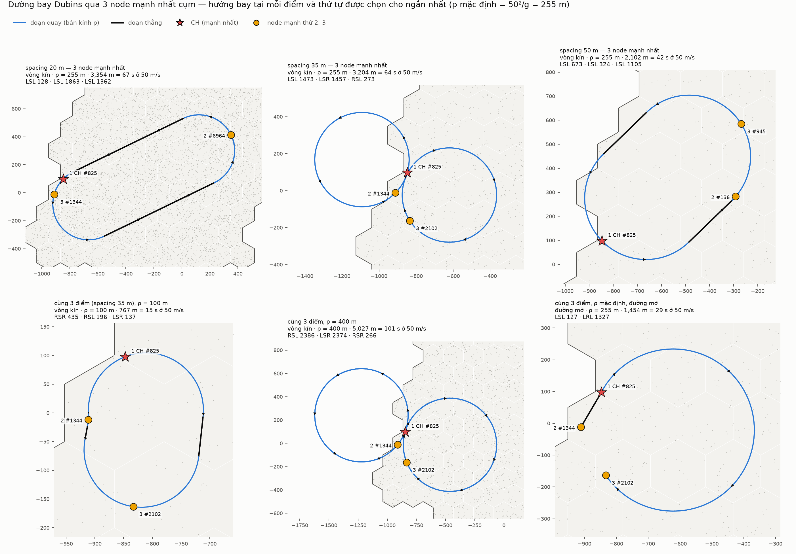

# Bước 1–2 — sinh mạng và đường bay

> Project mới `uav-coop`, dựa trên bộ tham số của các thí nghiệm đô thị trong `uav-sar`
> (A2G-RUN, A2G-SWEEP, G2G-CHAIN), gom vào `models/common/coop-params.h`. Chưa có node
> UAV: bước 2 mới chỉ xác định đường bay.


## ① Lưới lục giác đều từ gốc toạ độ

Lục giác đỉnh nhọn hướng lên, toạ độ trục (q, r); cell (0, 0) có tâm ở gốc.

| | |
|---|---|
| **bán kính đỉnh R** | **100 m** (`--radius`) |
| chiều rộng mặt–mặt = khoảng cách tâm hai cell kề = R√3 | 173.2 m |
| diện tích một cell = (3√3/2)·R² | 25 981 m² |

## ② Vùng: mọc ngẫu nhiên, rồi lấp chỗ lõm theo độ lồi κ

1. **Mọc ngẫu nhiên thật** từ cell gốc: mỗi bước chọn đều một cell trong "biên chờ" (các
   cell chưa chọn nhưng kề vùng), tới đủ N cell (`--cells`, mặc định 60). Không có khuôn
   hình định trước.
2. **Lấp chỗ lõm** tới độ lồi mục tiêu κ (`--convexity`, mặc định **1**). Chỗ lõm là các
   cell có tâm nằm trong bao lồi của vùng nhưng không thuộc vùng (vịnh và lỗ thủng). Mỗi
   lần lấp một cell: chọn cell **có nhiều láng giềng thuộc vùng nhất**, hoà thì bốc ngẫu
   nhiên. Nhờ vậy lỗ thủng và vịnh hẹp được lấp trước, vùng "phồng" dần ra cho tới khi
   độ lồi ≥ κ.

**Độ lồi** = số cell ÷ số cell có tâm nằm trong bao lồi các tâm cell của vùng. Lấp
không làm bao lồi thay đổi, nên độ lồi tăng tuyến tính tới 1.

- **κ = 1:** lấp hết → **lồi hoàn toàn**, không lỗ thủng.
- **κ ≤ độ lồi sẵn có** của vùng mọc ngẫu nhiên: không đổi gì. κ = 0 tái tạo đúng vùng của
  bản đầu (đã kiểm: trùng từng cell).


Trên 30 seed, vùng mọc ngẫu nhiên có độ lồi trung bình **0.70** (0.55–0.82). Số cell
phải lấp: κ = 0.7 → 3.7; 0.8 → 10.2; 0.9 → 18.8; **1 → 27.0** (nhiều nhất 49).

**Seed 1 (mặc định) là vùng kém lồi nhất trong 30 seed** (0.55): lồi hoá cần lấp 49 cell,
nâng vùng từ 60 lên **109 cell = 2.83 km²**, trải khoảng 2.0 × 2.45 km. Cụm cũng lớn hơn
hẳn trước vì R = 100 m làm mỗi cell lớn gấp 3. Nếu muốn cụm nhỏ hơn, giảm `--cells`.

Quá trình mọc ngẫu nhiên từng bước, và hình dạng theo seed khi chưa lấp:


## ③ Rải node ngẫu nhiên

Số node = diện tích ÷ spacing²; mỗi node rơi đều vào một cell rồi đều trong lục giác đó.


| spacing | số node | node / cell | láng giềng gần nhất TB |
|---|---|---|---|
| 20 m | 7080 | 65.0 | 10.1 m (0.51·s) |
| 35 m | 2312 | 21.2 | 17.7 m (0.51·s) |
| 50 m | 1133 | 10.4 | 25.5 m (0.51·s) |

Lý thuyết cho trường ngẫu nhiên đều là 0.50·s.

Các mật độ **lồng nhau**: các node ở 50 m chính là các node đầu tiên của 35 m.

## ④ Thuộc tính, CH và CL

Khả năng **quan sát** ~ U[0, 1), **tính toán** ~ U[0, 1), **giao tiếp** ~ U(0, 1]
(luôn > 0). Điểm = **tích** của ba thuộc tính: cao chỉ khi cả ba cùng cao. Không node
nào đứng đầu cả ba cùng lúc, nên cần một điểm gộp.

- **CH** = mạnh nhất vùng.
- **CL** = mạnh nhất mỗi cell. CH cũng là CL của cell nó nằm.


CH ở cả ba mật độ là cùng node **#825**: quan sát 0.96, tính toán 0.94, giao tiếp 1.00,
điểm 0.905. Có 109 CL; không cell nào trống, kể cả ở 50 m. Điểm trung bình của CL là
0.65 / 0.52 / 0.43 ở 20 / 35 / 50 m.

## ⑤ Đường bay Dubins qua 3 node mạnh nhất

3 node có điểm cao nhất cụm (CH là thứ nhất). Đường **Dubins**: chỉ tiến về phía trước,
bán kính quay tối thiểu **ρ** (`--rho`, mặc định **255 m** = 50²/g, tức 50 m/s nghiêng 45°
— cùng cú quay của thí nghiệm quét luống).

- **Vòng kín** (mặc định): máy bay cánh bằng không đứng yên được nên phải bay vòng lặp.
  `--open` cho một lượt bay mở.
- **Hướng bay tại mỗi điểm và thứ tự thăm** được chọn để đường ngắn nhất: duyệt toàn bộ
  hướng mỗi 1° ở cả 3 điểm, rồi tinh chỉnh tới 0.01°.
- Mỗi chặng là đường Dubins ngắn nhất trong 6 dạng LSL, RSR, LSR, RSL, RLR, LRL (L/R =
  quay trái/phải theo ρ, S = thẳng).



| | 3 node | vòng kín | đường thẳng nối 3 điểm | thời gian @ 50 m/s |
|---|---|---|---|---|
| 20 m | #825, #6964, #1344 | **3 354 m** | 2 698 m (+24 %) | 67 s |
| 35 m | #825, #1344, #2102 | **3 204 m** | 559 m (**+473 %**) | 64 s |
| 50 m | #825, #136, #945 | **2 102 m** | 1 644 m (+28 %) | 42 s |

**Khi 3 điểm nằm sát nhau so với ρ, bán kính quay chi phối tất cả.** Ở 35 m, ba node chỉ
cách nhau 100–300 m, trong khi đường kính quay là 510 m, nên máy bay phải lượn những
vòng lớn. Cùng 3 điểm đó:

| ρ | 100 m | 255 m | 400 m |
|---|---|---|---|
| vòng kín | 767 m | 3 204 m | 5 027 m |

Đường mở với ρ = 255 m chỉ còn 1 454 m.

## Kiểm tra tự động (1.58 triệu CHECK, tất cả qua)

- **Lưới:** R đúng 100 m; đỉnh cách tâm đúng R; tâm cell kề cách đúng R√3; 200 000 điểm
  ngẫu nhiên đều thuộc cell có tâm gần nhất; diện tích lục giác ÷ khung bao = 3/4.
- **Vùng:**
  - phần mọc: mỗi cell kề một cell có trước; liên thông, không trùng;
  - phần lấp: chỉ lấp chỗ lõm của vùng mọc (nằm trong bao lồi của nó), và đúng
    ⌈κ·|bao|⌉ cell;
  - độ lồi đo lại khớp; κ = 1 → độ lồi đúng 1 và không lỗ thủng.
- **Node:** đủ số lượng, nằm trong đúng lục giác của mình; kiểm định χ² cho phân bố đều.
- **Vai trò:** thuộc tính trong miền (giao tiếp > 0); đúng một CH không ai hơn; mỗi cell
  có node có đúng một CL không ai hơn.
- **Dubins:**
  - với 20 000 cặp tư thế ngẫu nhiên, **cả 6 dạng** (không chỉ dạng ngắn nhất) đều dựng
    lại đúng tư thế đích (sai số < 10⁻⁶ ρ);
  - đường ngắn nhất không bao giờ ngắn hơn đường thẳng; đi thẳng phía trước cho đúng
    đường thẳng.
- **Đường bay:**
  - mỗi chặng đáp đúng tư thế kế tiếp; bay đúng bán kính (mẫu 1 m: không quay quá 1/ρ
    mỗi mét);
  - đi qua đúng 3 điểm; tinh chỉnh chỉ làm ngắn đi;
  - không bộ hướng ngẫu nhiên nào (400 bộ × mọi thứ tự) ngắn hơn đường đã chọn.

## Điểm còn mở

- **Cụm khá lớn** với R = 100 m và lấp tới lồi (2.83 km² ở seed 1). Giảm `--cells` nếu cần.
- Node vẫn có thể nằm rất sát nhau (nhỏ nhất 0.18 m ở 20 m) — có thể đổi sang rải có
  khoảng cách tối thiểu.
- Đường bay mới là hình học 2D, chưa có độ cao hay node UAV.

## Chạy lại

```bash
B=/home/user/ns3-dev/build/src/uav-coop/examples/ns3.46-uav-coop-deploy-optimized
$B --spacings=20,35,50 --out=deploy                       # R=100, 60 cell, κ=1, ρ=255, vòng kín
for k in 0.55 0.7 0.85 1; do $B --convexity=$k --spacings=35 --out=conv$k; done
for s in 1 2 3 4 5 6; do $B --convexity=0 --seed=$s --spacings=50 --out=seed$s; done
for r in 100 400; do $B --rho=$r --spacings=35 --out=rho$r; done
$B --open --spacings=35 --out=open
# sweep.csv: κ ∈ {0.6 … 1} × seed 1..30, các cột 2–5 của *-region.csv
python3 tools/deploy_figures.py . docs/figures --seeds "seed*-lattice.csv" --conv "conv*-lattice.csv" --sweep sweep.csv
```

Dữ liệu cho các hình: `docs/data/`.
