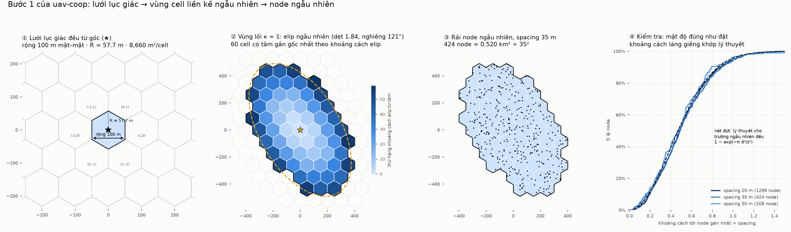
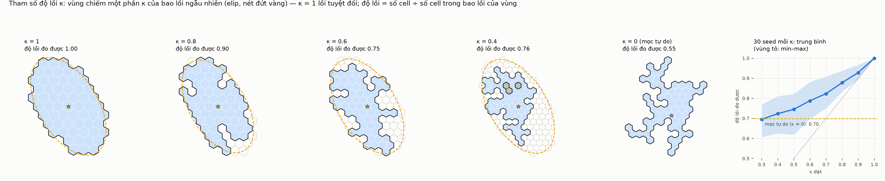
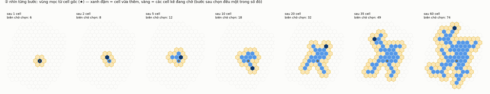
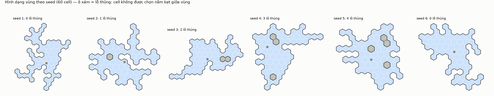
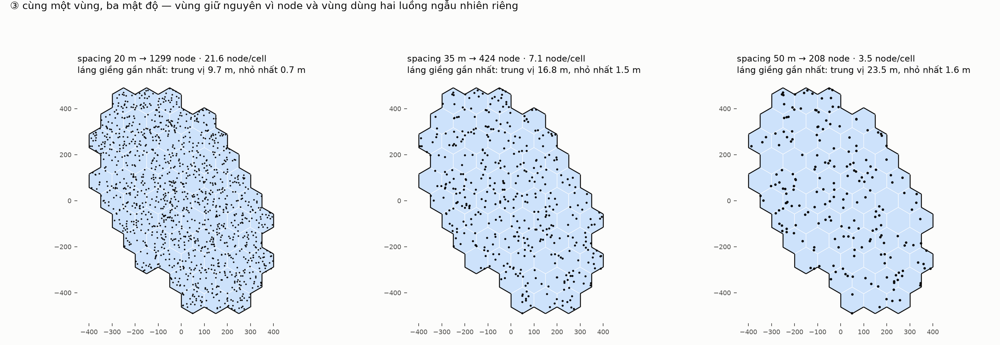
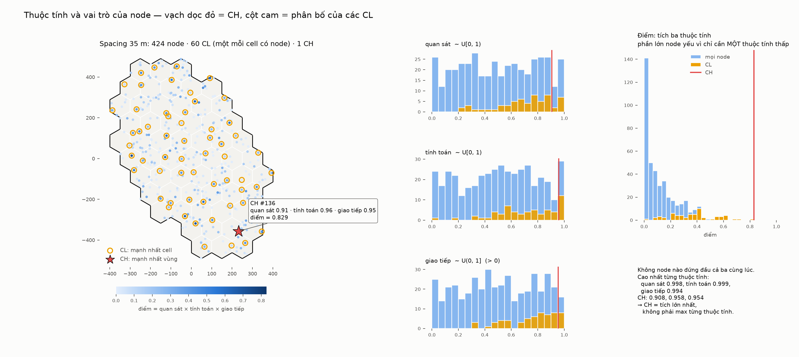

# Bước 1 — sinh mạng: lưới lục giác → vùng liền kề → node có thuộc tính → CH, CL

> Project mới `uav-coop`, dựa trên bộ tham số của các thí nghiệm đô thị trong `uav-sar`
> (A2G-RUN, A2G-SWEEP, G2G-CHAIN), gom vào `models/common/coop-params.h`. Bước này chỉ
> dùng phần hình học; các khối tham số vô tuyến được mang sang sẵn cho các bước sau.



## ① Lưới lục giác đều từ gốc toạ độ

Lục giác đỉnh nhọn hướng lên, toạ độ trục (q, r); cell (0, 0) có tâm ở gốc.

| | |
|---|---|
| chiều rộng (mặt–mặt) = khoảng cách tâm hai cell kề | **100 m** (`--width`) |
| bán kính đỉnh R = rộng / √3 | 57.7 m |
| diện tích một cell = (√3/2)·rộng² | 8 660 m² |

## ② Vùng liền kề, có tham số độ lồi κ

**κ = tỉ lệ vùng chiếm trong một bao lồi ngẫu nhiên** (`--convexity`, mặc định **1**):

1. **Bao lồi:** lấy ⌈N/κ⌉ cell có tâm gần gốc nhất theo một **khoảng cách elip ngẫu
   nhiên** — độ dẹt ~ U[1, 2] (`--maxAspect`), hướng ~ U[0°, 180°). Đây là lưới bị cắt
   bởi một tập lồi, nên bao lồi luôn lồi.
2. **Vùng:** mọc ngẫu nhiên từ cell gốc **bên trong** bao cho tới đủ N cell.

| κ | vùng |
|---|---|
| **1** | chính là bao lồi → **lồi tuyệt đối** (độ lồi đo được 1.000, không lỗ thủng) |
| 0 < κ < 1 | tập con liền kề ngẫu nhiên của bao → lởm chởm, có lỗ thủng |
| 0 | không có bao, mọc tự do — đúng như bản đầu của bước này (đã kiểm: **trùng từng byte**) |

**Độ lồi đo được** = số cell ÷ số cell có tâm nằm trong bao lồi của các tâm cell của
vùng. Vùng lồi cho đúng 1.



Trung bình 30 seed: κ = 1 → **1.000**; 0.9 → 0.93; 0.8 → 0.88; 0.7 → 0.82; 0.6 → 0.79;
0.5 → 0.75; 0.4 → 0.72; 0.3 → 0.70. Mọc tự do cho khoảng 0.70.

- Độ lồi đo được giảm **đơn điệu** theo κ, và luôn ≥ κ (bao lồi của tập con nhỏ hơn bao
  ban đầu).
- Dưới κ ≈ 0.4 thì **bão hoà** ở mức của mọc tự do: bao lồi lúc đó không còn ràng buộc.
  Dải có ích cho thử nghiệm không lồi là **κ ∈ [0.4, 1]**.
- Với κ < 1 có trung bình 2–3 **lỗ thủng** (cell không được chọn nằm kẹt giữa vùng). Khi
  thử vùng không lồi, cần quyết định giữ hay lấp các lỗ này.

Mặc định hiện tại (seed 1, κ = 1): elip dẹt 1.84, nghiêng 121°; 60 cell; 0.52 km²; trải
800 × 981 m.

Mọc tự do (κ = 0) — từng bước và theo seed — vẫn giữ để tham khảo:



## ③ Rải node ngẫu nhiên

Số node = diện tích ÷ spacing² (một node trên mỗi spacing² mét vuông). Mỗi node: chọn đều
một cell (các cell có diện tích bằng nhau), rồi chọn đều một điểm trong lục giác đó.



| spacing | số node | node / cell | láng giềng gần nhất: TB · nhỏ nhất |
|---|---|---|---|
| 20 m | 1299 | 21.7 | 10.3 m (0.52·s) · 0.7 m |
| 35 m | 424 | 7.1 | 18.1 m (0.52·s) · 1.5 m |
| 50 m | 208 | 3.5 | 24.7 m (0.49·s) · 1.6 m |

Lý thuyết cho trường ngẫu nhiên đều là 0.50·s.

Các mật độ **lồng nhau**: dùng cùng luồng ngẫu nhiên, nên 208 node ở 50 m chính là 208
node đầu của 424 node ở 35 m. Giảm mật độ chỉ là bớt node đi, không phải một mạng khác.

## ④ Thuộc tính của node, CH và CL

Mỗi node mang ba khả năng (không thứ nguyên):

| thuộc tính | phân bố |
|---|---|
| khả năng quan sát | U[0, 1) — có thể bằng 0 |
| khả năng tính toán | U[0, 1) — có thể bằng 0 |
| khả năng giao tiếp | U(0, 1] — luôn > 0 |

**"Có cả 3 cao nhất" → điểm = quan sát × tính toán × giao tiếp.** Hiếm có node nào đứng
đầu cả ba cùng lúc. Thực tế, ở **cả ba mật độ không có node nào như vậy**, nên cần gộp
thành một điểm. Dùng **tích** vì nó đòi hỏi cả ba cùng cao: chỉ một thuộc tính thấp là
điểm thấp. Cách này cũng cùng dạng với khả năng node trong `uav-sar`.

- **CH** = node có điểm cao nhất toàn vùng.
- **CL** = node có điểm cao nhất mỗi cell. CH cũng là CL của cell nó nằm; cell không có
  node thì không có CL.
- Hoà điểm: chọn id nhỏ hơn.



| spacing | CH (id, cell): quan sát / tính toán / giao tiếp = điểm | số CL | cell trống | điểm TB của CL |
|---|---|---|---|---|
| 20 m | #825 (−4, 1): 0.96 / 0.94 / 1.00 = 0.905 | 60 | 0 | 0.534 |
| 35 m | #136 (4, −4): 0.91 / 0.96 / 0.95 = 0.829 | 60 | 0 | 0.371 |
| 50 m | #136 (4, −4): 0.91 / 0.96 / 0.95 = 0.829 | 57 | 3 | 0.283 |

Ở 35 m và 50 m, CH là cùng một node — hệ quả của các mật độ lồng nhau. Điểm của CL
giảm khi mật độ thưa đi, vì mỗi cell có ít ứng viên hơn.

Thuộc tính dùng **luồng ngẫu nhiên riêng**: thêm thuộc tính không làm đổi vị trí node
(đã kiểm, trùng từng byte với trước).

## Ngẫu nhiên và kiểm tra

`mt19937_64` lấy thẳng 53 bit cao (không qua `std::uniform_*`, vốn phụ thuộc thư viện),
nên cùng seed cho cùng mạng trên mọi trình biên dịch. Có bốn luồng riêng: vùng, vị trí
node, kiểm thử, thuộc tính. Chạy lại cùng seed ra file giống hệt.

Kiểm tra tự động (1.2 triệu CHECK, tất cả qua):

- **Lưới:** đỉnh cách tâm đúng R; tâm cell kề cách đúng 100 m; 200 000 điểm ngẫu nhiên
  đều thuộc cell có tâm gần nhất; diện tích lục giác ÷ khung bao = 3/4.
- **Vùng:** đủ số cell, không trùng, liên thông. Nằm trong bao, và bao đúng kích thước,
  lồi, liên thông. Với κ = 1: độ lồi đúng 1 và không lỗ thủng. Với vùng mọc: mỗi cell kề
  một cell có trước.
- **Node:** đủ số lượng, nằm trong vùng và đúng lục giác của mình; số node mỗi cell qua
  kiểm định χ².
- **Vai trò:** thuộc tính trong miền (giao tiếp > 0); đúng một CH, không node nào điểm
  cao hơn nó, và CH cũng là CL; mỗi cell có node có đúng một CL, và không node nào
  trong cell hơn CL.

## Điểm còn mở

- **Rải đều cho phép node sát nhau** (nhỏ nhất 0.7 m ở 20 m). Nếu cần khoảng cách tối
  thiểu, có thể đổi sang rải Poisson-disk, vẫn giữ mật độ.
- **Phân bố thuộc tính** đang là đều trên [0, 1]. Nếu muốn mô hình hoá một tỉ lệ node
  không có cảm biến (quan sát = 0 đúng nghĩa đen), cần thêm một khối xác suất tại 0.

## Chạy lại

```bash
B=/home/user/ns3-dev/build/src/uav-coop/examples/ns3.46-uav-coop-deploy-optimized
$B --seed=1 --spacings=20,35,50 --out=deploy                    # κ = 1 (mặc định)
for k in 1 0.8 0.6 0.4 0; do $B --convexity=$k --seed=1 --spacings=35 --out=conv$k; done
# sweep.csv: for k in 1 0.9 ... 0.3 0; for s in 1..30: --convexity=$k --seed=$s, cột 6 của *-region.csv
python3 tools/deploy_figures.py . docs/figures --conv "conv*-lattice.csv" --sweep sweep.csv
# hình mọc tự do: --prefix free (vào một thư mục khác để không ghi đè deploy-steps.png)
```

Dữ liệu cho các hình: `docs/data/`.
