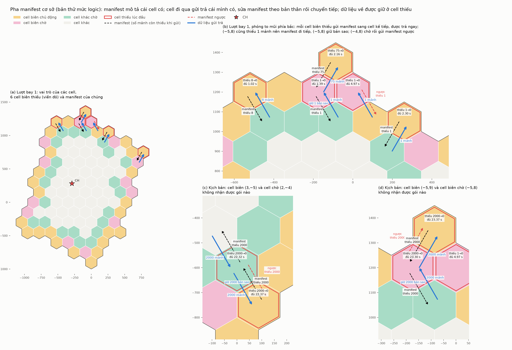
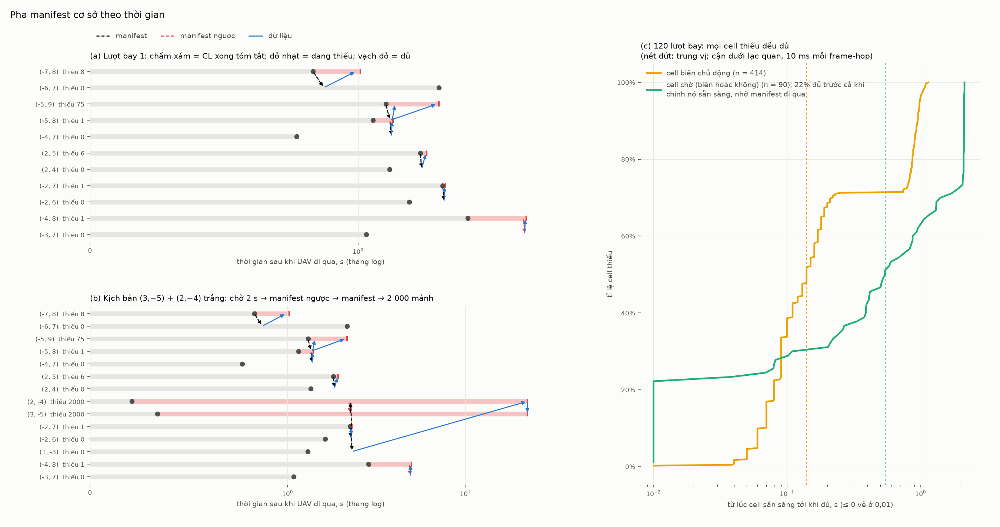
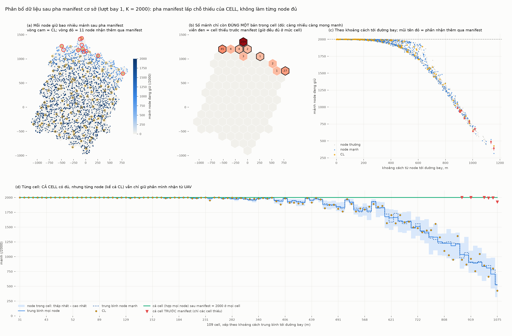
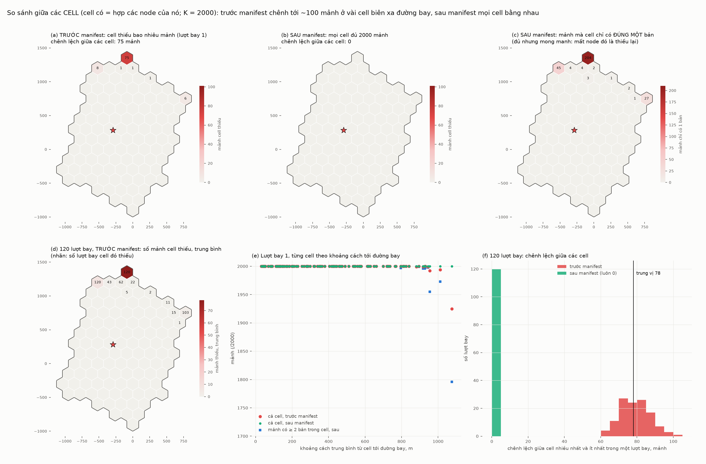
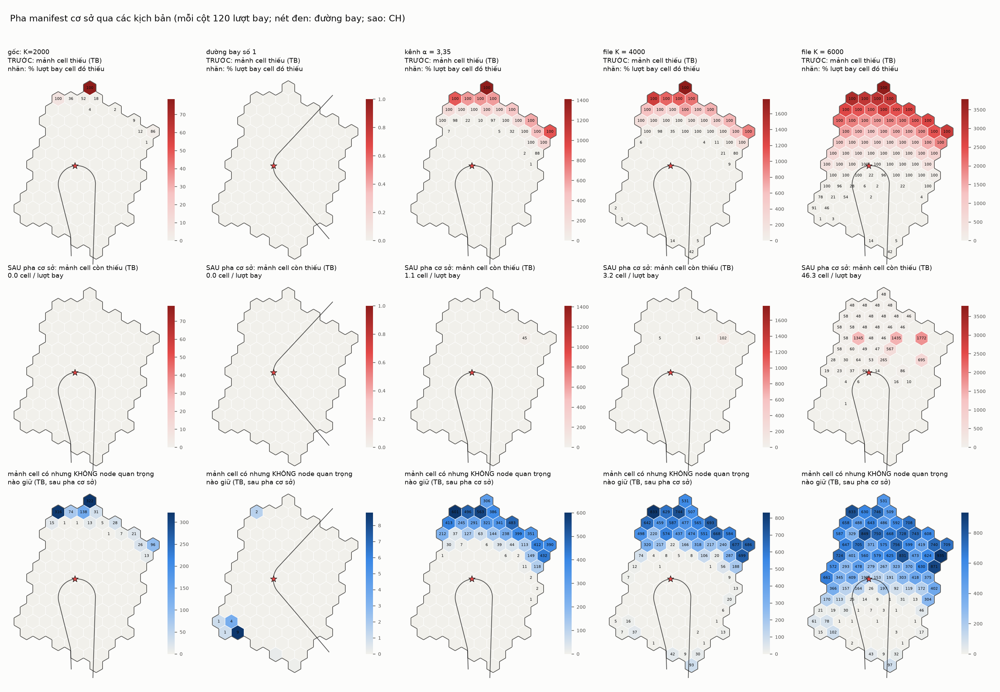
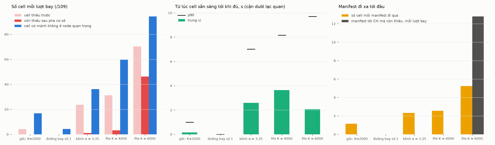
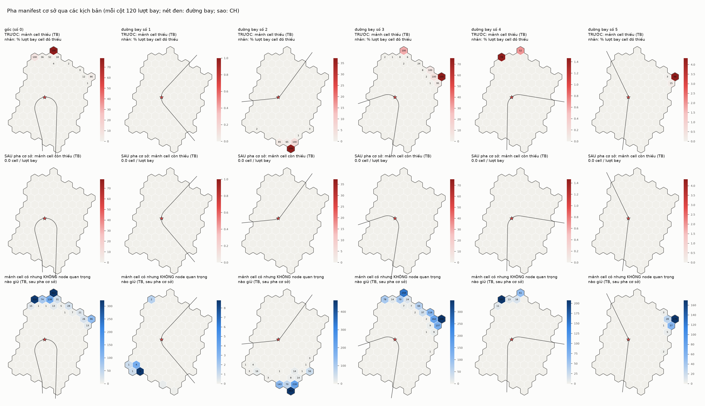
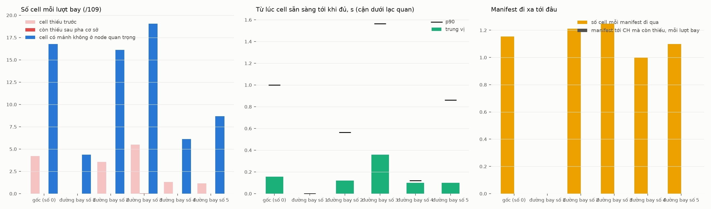

# Bước 5 — Manifest giữa các cell (pha cơ sở)

## 0. Bản tham chiếu gốc (nguyên văn, không chỉnh sửa)

Các đoạn dưới đây là mô tả của tác giả, chép nguyên văn để làm chuẩn đối chiếu. Mọi
phần đặc tả và cài đặt phía sau phải khớp với chúng. Chỗ nào chưa khớp thì ghi rõ ở
mục 4.

**(a) Ý tưởng ban đầu** (trích phần nói về manifest; câu cuối của tin nhắn này nói về việc cài chia sẻ nội cell trước)

> ý tưởng là trong một cell các gói được tính là tài sản chung và tự trao đổi nhanh để nắm bắt tình hình của nhau, nếu cell đó thiếu mảnh nào thì manifest mảnh đó.
> gói tin manifest sẽ được gửi về hướng CH nhưng không cần phải tới được Ch. Trên đường gói tin đó đi, các cell nghe manifest nếu có thể đáp ứng thì đáp ứng luôn và sửa lại manifest theo điều kiện cell đó hiện tại, dần dần manifest sẽ được đáp ứng ngay cả khi nó chưa tới được CH

**(b) Cơ chế**

> theo tôi như này:
> khu vực vốn đã lên kế hoạch ký nên các cell vốn đã biết được vị trí của nhau rồi. cell nằm ở biên ngay sau khi tóm tắt nội cell xong( không còn nhận được gói mới từ uav nữa) nó chủ động manifest tới cell tiếp theo. các cell không phải biên thì chỉ chờ mà không chủ động. nếu sau khoảng thời gian đó các cell khác thấy cell biên đáng lẽ phải manifest cho mình thì tự manifest ngược đến nó ( vì đây nằm trong hai trường hợp hoặc là cell biên đã nhận đủ hoặc là cell biên chưa nhận được gói nào nên manifest chưa được trigger) cell nhận được môt manifest ngược sẽ tự hiểu ra tình hình.
> nội dung gói manifest như bạn đề xuất
> trong lúc đang manifest các cell cũng không nằm yên mà tiếp tục tiến hành trao đổi dữ liệu nội cell như đã tóm tắt từ trước để tiết kiệm thời gian, dữ liệu mới đến thì nó cũng được truyền theo đường này đến các node quan trọng
> khi manifest đến nếu cell đó có một trong số các gói được manifest thì nó gửi luôn và cắt bới manifest đồng thời dữ liệu đi qua cell đó mà nó thấy thiếu thì nó cũng tự lưu một bản sao cho bản thân
> về lý thuyết, chỉ các cell ở biên manifest nhưng các cell còn lại đều hưởng lợi
> nếu manifest đến CH mà CH vẫn không thể đáp ứng, nó có thể đoán được hướng đang có và hướng đang thiếu để manifest tiếp (hướng nào không có manifest đến thì coi như là có đủ) nhưng pha manifest cơ sở coi như dừng lại tại đây khi mà manifest tới CH, cluster vấn tiếp tục chạy manifest tiếp nhưng sẽ gọi la bước manifest thứ cấp, chạy song song với nhiệm vụ nhận diện (tạm thơi chưa bàn)
> với khe thời gian, với mỗi cell các cặp gateway có kênh riêng để giao tiếp intercell,
> mảnh nhận lưu luôn tại CL và các node mạnh

**(c) Trả lời các đề xuất**

> trả lời các đề xuất của bạn:
> 1. không cần gửi gói thông báo đủ, nếu cell biên đủ thì cell bên trong cũng có khả năng đã đủ tất nhiên cũng không cần manifest ngược nữa. cho nên cell trong cũng dựa trên trạng thái của bản thân đánh giá tình hình, nếu nó đủ cũng có nghĩa là cell biên ít nhiều cũng có được thông tin, nếu nó thiếu thì mới manifest ngược (cell trong ở đây chỉ các cell cận biên nằm ngay cạch cell biên, không phải cell nào cũng chờ
> 2 đề xuất 2 tôi đồng ý
> 3 đề xuất này tôi sẽ đính chính thêm về thiết kế manifest như sau: các manifest mang thông tin về những cell đi qua có gì ví dụ: có tổng 3 file ABC với các gói lần lượt là 1,2,3,4,5,6,7,8,9 cell biên gửi manifest A4689 tức là nó đang có đủ file A thiếu gói 5 của file B và gói 7 của file C.  cell bên trong nhận được đối chiếu bộ dữ liệu thấy mình có gói 5 thì ngay lập tức gửi cho cell biên và sửa lại nội dung manifest là AB89 cho cell tiếp theo, cell tiếp theo gửi gói 7 trở lại thì nó lưu một bản sao và chuyển tiếp cho cell biên
> tôi đồng ý với đề xuất 4 cần có lập lịch tốt cho gateway
> đề xuất 5 6 7 cũng như ví dụ tôi nêu trên
> trong khi viết đặc tả, lưu lại nguyên văn đoạn mô tả của thôi không chỉnh sửa để làm bản tham chiếu gốc và bắt đầu cài đặt thử

Các đề xuất 1–7 mà (c) trả lời:
1. cell biên đủ thì gửi gói "ĐỦ" thay vì im lặng;
2. lấy thời điểm "UAV đã đi khỏi" theo kế hoạch bay;
3. cell bên trong thiếu thì gửi kèm phần thiếu vào manifest đang đi qua;
4. gateway chỉ có một radio nên cần lịch;
5. cắt manifest nhưng có xác nhận và phát lại;
6. CL báo danh sách thiếu cho các gateway của cell;
7. gộp manifest khi gặp nhau.

**(d) Đính chính sau bản thử đầu**

> 1. manifest mô tả những gì mình có, không phải những gì mình thiếu, những mảnh nó chưa có thì đều là mảnh thiếu
> 2. chỉ những cell biết phía trước mình có một cell biên khác mới chờ, nếu nó cũng vừa là biên nhưng lại vừa là bước tiếp theo của cell biên khác vậy thì nó cũng chờ, chỉ những cell biên không có biên khác của mình sẽ chủ động gửi manifest
> 3. ta sẽ thử bằng thử nghiệm sau
> 4. dữ liệu về CL đi qua các node mạnh thì nó tự lưu lại một bản sao cho mình chứ không chủ động yêu cầu dữ liệu

(d) trả lời bốn phát hiện của bản thử đầu:
1. cell cận biên tự thiếu mà vẫn nghe được manifest của cell biên;
2. 13 cell biên có cell kế tiếp cũng là cell biên;
3. cell biên trắng cạnh cell cận biên đủ;
4. chi phí lưu ở các node quan trọng.

## 1. Thuật ngữ

| | |
|---|---|
| **cell biên** | cell có ít nhất một cạnh lục giác giáp ngoài cụm (seed 1: 40 / 109 cell) |
| **cell kế tiếp** của cell X | cell đầu tiên trên đường chính từ CL của X về CH, đi qua gateway (ROUTING-vi.md) |
| **X chờ b** | X là cell kế tiếp của cell biên b. X có thể là cell biên hay không (d-2) |
| **cell chờ** | cell chờ ít nhất một cell biên. Seed 1: 13 cell biên + 22 cell khác |
| **cell biên chủ động** | cell biên không chờ cell biên nào. Seed 1: 27 cell |
| **trạng thái của cell** | hợp các mảnh mà mọi node trong cell có; CL biết chính xác sau bước tóm tắt (SUMMARY-vi.md) |
| **node mạnh** | node có điểm năng lực > trung bình của cell |

## 2. Gói manifest: những gì cell CÓ

Manifest mô tả **những gì cell có**. Mảnh nào chưa có đều là mảnh thiếu (d-1). Theo ví dụ
(c):
- Có 3 file: A = gói 1–3, B = 4–6, C = 7–9.
- Manifest `A4689` = có đủ A; với B có 4, 6; với C có 8, 9. Vậy thiếu 5 và 7.

```
loại (MANIFEST / MANIFEST NGƯỢC) | cell gốc (q, r) | seq | TTL
cho mỗi file:  fileId | ĐỦ                      -- "A"
                      | đoạn manifest (manifest.h) của các gói có (bộ mã tự chọn: liệt kê có,
                        liệt kê thiếu, hay bitmap, tuỳ cách nào ngắn hơn -- nội dung vẫn là "có")
```

**Sửa manifest ở cell đi qua.** Cell X nhận manifest M:
1. X gửi trả ngay những gì X có mà M thiếu, và coi chúng là đã có: `A4689` → `AB89`
   (X có gói 5).
2. Manifest X chuyển đi tiếp mô tả **X như hiện tại**, theo nguyên tắc (a) "sửa lại
   manifest theo điều kiện cell đó hiện tại": một mảnh là "có" nếu nó có trong M (sau
   bước 1) **và** X cũng có. Mảnh nào X thiếu thì thành mảnh thiếu, kể cả khi cell gốc đã
   có.
3. Cell phía trước gửi trả mảnh đó. X **giữ lại cho mình**, và chỉ chuyển tiếp về phía
   cell gốc nếu cell sau nó cũng thiếu (theo manifest cell đó đã gửi cho X).

Ví dụ: X thiếu gói 8 mà cell gốc có. Manifest X gửi đi là `AB9`. Cell kế tiếp gửi gói 8
về, X giữ, và không chuyển cho cell gốc.

Nhờ cách sửa này, phần thiếu của **mọi cell manifest đi qua tự gộp vào manifest**: "chỉ
các cell ở biên manifest nhưng các cell còn lại đều hưởng lợi" (b).

## 3. Hành vi (pha cơ sở)

1. **Kích hoạt.** Cell biên chủ động gửi manifest (những gì nó có) tới cell kế tiếp khi
   đủ ba điều kiện:
   - đã xong tóm tắt nội cell;
   - UAV đã ra khỏi tầm theo kế hoạch bay (đề xuất 2, (c) đồng ý);
   - cell đó thiếu.

   Cell biên chủ động mà đủ, hoặc chưa nhận được gói nào (không có gì kích hoạt), thì im
   lặng.
2. **Cell chờ** chờ T_chờ rồi xét **trạng thái của chính mình** (c-1):
   - đủ → không làm gì;
   - thiếu → gửi **manifest ngược** (những gì nó có) tới từng cell biên lẽ ra phải gửi cho
     nó mà chưa gửi.
3. **Nhận manifest:** đối chiếu, gửi trả, sửa manifest, chuyển tiếp như mục 2. Manifest
   không còn mảnh thiếu thì dừng.
4. **Dữ liệu đi ngược về:** cell nào dữ liệu tới cũng giữ phần mình thiếu, và chỉ chuyển
   tiếp phần mà cell sau nó thiếu.
5. **Lưu:** mảnh giữ lại được đưa **về CL**. Node mạnh nào nằm trên đường đó tự lưu một bản
   sao, không chủ động xin dữ liệu (d-4).
6. **Nhận manifest ngược, tại cell biên:**
   - gửi trả những gì cell chờ thiếu mà mình có;
   - nếu chính nó cũng thiếu, kể cả chưa nhận được gì ("tự hiểu ra tình hình"), thì từ
     giờ coi như đã được kích hoạt: gửi manifest của mình như bước 1.
7. **Tới CH:** pha cơ sở dừng. Phần còn lại thuộc pha thứ cấp (chưa bàn).
8. **Song song:** trao đổi nội cell vẫn chạy (b). Mỗi cặp gateway có kênh riêng; cần lịch
   cho gateway (đề xuất 4).

## 3b. Mã giả

Mã giả dưới đây mô tả đúng những gì bản cài chạy: `examples/coop-summary.cc` cho Thuật toán
2 và `examples/coop-manifest.cc` cho Thuật toán 3–5. Tất cả các thuật toán đều hướng sự kiện:
mỗi thủ tục `KHI …` chạy khi sự kiện tương ứng xảy ra.

### Ký hiệu

| ký hiệu | nghĩa |
|---|---|
| $\mathcal{C}$, $\mathcal{B}\subseteq\mathcal{C}$ | tập cell; tập cell biên (có cạnh giáp ngoài cụm) |
| $V(c)$, $\mathrm{CL}(c)$ | các node của cell $c$; CL của cell $c$ |
| $I(c)$ | **node quan trọng** của cell $c$: $\{\mathrm{CL}(c)\}\cup\{v\in V(c): s(v)>\bar s(c)\}$, với $s(v)$ là điểm năng lực, $\bar s(c)$ là trung bình của cell |
| $c_{\mathrm{CH}}$ | cell chứa CH |
| $\mathrm{next}(c)$ | cell kế tiếp của $c$ trên đường chính từ $\mathrm{CL}(c)$ về CH; $\mathrm{next}(c_{\mathrm{CH}})=\bot$ |
| $\mathrm{gw}(a,b)=(g_a,g_b)$ | liên kết gateway duy nhất giữa hai cell kề $a,b$; $g_a\in V(a)$, $g_b\in V(b)$ |
| $\mathrm{toCL}(v)$ | next hop của node $v$ tới CL của cell mình (cây trong cell) |
| $F=\{0,\dots,K-1\}$ | các mảnh, chia đều thành $F_1,\dots,F_m$ file |
| $h_v\subseteq F$ | các mảnh node $v$ đang giữ |
| $H_c=\bigcup_{v\in V(c)}h_v$ | các mảnh cell $c$ đang có (trạng thái của cell) |
| $L_c=F\setminus H_c$ | các mảnh cell $c$ thiếu |
| $t^{\mathrm{rdy}}_c$, $T_{\mathrm{wait}}$, $\mathrm{TTL}$ | lúc CL của $c$ có tóm tắt nội cell; thời gian chờ; số cell tối đa một manifest đi |

Một **manifest** là bộ $\langle o,\pi,\Sigma,\tau\rangle$:
- $o$: cell gốc;
- $\pi=(\pi_0=o,\pi_1,\dots,\pi_k)$: các cell manifest đã đi qua;
- $\Sigma=(\Sigma_0,\dots,\Sigma_{k-1})$: $\Sigma_i\subseteq F$ là nội dung "**có**" mà $\pi_i$ đã
  gửi cho $\pi_{i+1}$; nội dung hiện tại là $\Sigma_{k-1}$;
- $\tau$: TTL còn lại.

Trên đường truyền, nội dung được mã hoá theo từng file: một cờ ĐỦ, hoặc các đoạn manifest
(mục 2).

Một **lô dữ liệu** là bộ $\langle\pi,\Sigma,i,J\rangle$: tập mảnh $J$ đang tới cell $\pi_i$ trên
đường về cell gốc.

### Thuật toán 1 — Lập vai trò (tại BS, trước khi bay)

```text
Algorithm 1  PLANROLES(C, B, next)
 1: for each c ∈ C do
 2:     up(c) ← { b ∈ B : next(b) = c }                 ▷ cell biên lẽ ra gửi manifest cho c
 3: for each c ∈ C do
 4:     if up(c) ≠ ∅ then role(c) ← WAITER              ▷ (d-2): kể cả khi c cũng là cell biên
 5:     else if c ∈ B then role(c) ← INITIATOR          ▷ cell biên không chờ cell biên nào
 6:     else role(c) ← NONE
 7: return role, up
```

### Thuật toán 2 — Tóm tắt nội cell về CL (SUMMARY-vi.md)

Mỗi node gửi lên cha **giao các phần thiếu** của cả nhánh của nó. Lên tới CL, kết quả chính
là $L_c$.

```text
Algorithm 2  INTRACELLSUMMARY(c)                       ▷ chạy song song ở mọi cell
 1: for each v ∈ V(c) do
 2:     λ_v ← F \ h_v                                   ▷ phần thiếu của nhánh, ban đầu của riêng v
 3:     μ_v ← {v}                                       ▷ mặt nạ các node đã được tính
 4:     p_v ← toCL(v);  children(v) ← { u : toCL(u) = v }
 5: σ ← thứ tự hậu tự của cây toCL (con trước cha)      ▷ lịch TDMA, mỗi khe một node phát
 6: repeat theo vòng, mỗi khe một node v theo σ:
 7:     if mọi con của v đã gửi đủ, hoặc mọi con chưa đủ đã im lặng ≥ G·(cao(u)+1) vòng then
 8:         gửi đoạn manifest kế tiếp của λ_v, kèm μ_v, cho p_v; chờ ACK trong khe
 9:         if 3 lần liền không ACK and còn cha thay thế then
10:             p_v ← node gần CL hơn theo (số hop, id) trong tầm 1.5·r_link;  gửi lại từ đầu
11: KHI node u nhận một đoạn [a,b) của λ_w, μ_w từ con w:
12:     λ_u[j] ← λ_u[j] ∧ λ_w[j]   với mọi j ∈ [a,b)        ▷ giao phần thiếu = hợp phần có
13:     if đây là đoạn cuối then μ_u ← μ_u ∪ μ_w
14:     if u đã bắt đầu gửi and λ_u hay μ_u thay đổi then u gửi lại tóm tắt từ đầu
15: CL kết thúc khi μ_CL = V(c):  L_c ← λ_CL,  H_c ← F \ L_c
```

### Thuật toán 3 — Kích hoạt

```text
Algorithm 3  TRIGGERS
 1: KHI t = t^rdy_c với role(c) = INITIATOR:
 2:     if not sent(c) and 0 < |L_c| < K then SENDOWN(c)   ▷ chưa nhận được gì thì không có gì kích hoạt
 3: KHI t = t^rdy_c + T_wait với role(c) = WAITER:
 4:     if L_c = ∅ then return                          ▷ (c-1): mình đủ thì cell biên "ít nhiều cũng đủ"
 5:     for each b ∈ up(c) chưa gửi manifest qua c do
 6:         gửi MANIFEST NGƯỢC ⟨c, (c,b), (H_c), 1⟩ tới b qua gw(c,b)
 7:
 8: procedure SENDOWN(c)
 9:     sent(c) ← true
10:     PASSON(c, ⟨c, (c), (H_c), TTL⟩)
11:
12: procedure PASSON(x, ⟨o,π,Σ,τ⟩)                      ▷ x = π_k, nội dung hiện tại M = Σ_{k-1}
13:     if M = F then return                            ▷ không còn gì thiếu
14:     if next(x) = ⊥ then                             ▷ x là cell của CH
15:         ghi nhận F \ M cho PHA THỨ CẤP; return      ▷ pha cơ sở dừng ở CH
16:     if τ = 0 then return
17:     y ← next(x);  (g_x, g_y) ← gw(x,y)
18:     gửi ⟨o, π‖y, Σ, τ−1⟩ từ CL(x) qua g_x → g_y
```

### Thuật toán 4 — Nhận manifest (tại mỗi cell trên đường)

```text
Algorithm 4  ONMANIFEST(x, ⟨o,π,Σ,τ⟩)                  ▷ x = π_k; tại CL(x), sau khi đi g_y → CL(x)
 1: M ← Σ_{k−1};  heard(x) ← heard(x) ∪ {π_{k−1}}
 2: G ← (F \ M) ∩ H_x                                    ▷ những gì x có mà manifest thiếu
 3: SENDBACK(x, k, π, Σ, G)                              ▷ gửi ngay về cell gốc
 4: M ← M ∪ G                                           ▷ cắt manifest: "A4689" → "AB89"
 5: M ← M ∩ H_x                                         ▷ (a), (d-1): manifest đi tiếp mô tả x như hiện tại;
 6:                                                      ▷   mảnh x thiếu thành mảnh thiếu
 7: PASSON(x, ⟨o, π, Σ‖M, τ⟩)
 8:
 9: procedure SENDBACK(x, k, π, Σ, G)
10:     if G = ∅ then return
11:     for each j ∈ G do chọn holder v ∈ V(x) có j, gần gateway về π_{k−1} nhất
12:     gửi lô ⟨π, Σ, k−1, G⟩ qua gw(x, π_{k−1})
```

### Thuật toán 5 — Dữ liệu đi ngược về và manifest ngược

```text
Algorithm 5a  ONDATA(⟨π,Σ,i,J⟩)                         ▷ lô J tới cell z = π_i tại node g_z
 1: K_z ← J \ H_z                                       ▷ những gì z đang thiếu: giữ bản sao
 2: for each j ∈ K_z do
 3:     chuyển j theo toCL từ g_z tới CL(z)
 4:     for each v trên đường đó với v ∈ I(z) do h_v ← h_v ∪ {j}   ▷ (d-4): node mạnh tự giữ bản sao
 5: H_z ← H_z ∪ K_z
 6: if i = 0 then return                                ▷ z là cell gốc
 7: P ← { j ∈ J : j ∉ Σ_{i−1} }                         ▷ chỉ những gì cell phía sau đã báo là thiếu
 8: if P ≠ ∅ then gửi lô ⟨π, Σ, i−1, P⟩ qua gw(z, π_{i−1})
 9:                                                      ▷ (mảnh vừa giữ đi từ CL, mảnh khác đi thẳng gateway → gateway)

Algorithm 5b  ONREVERSE(b, ⟨w,(w,b),(H_w),1⟩)           ▷ tại cell biên b, từ cell chờ w
 1: SENDBACK(b, 1, (w,b), (H_w), (F \ H_w) ∩ H_b)       ▷ gửi cho w những gì b có mà w thiếu
 2: if not sent(b) and L_b ≠ ∅ then SENDOWN(b)          ▷ "tự hiểu ra tình hình", kể cả khi chưa nhận được gì
```

### Các tính chất (được kiểm tự động trong mọi lần chạy)

1. **An toàn.**
   - $H_c$ chỉ tăng.
   - Mọi mảnh được gửi đi đều do một node thực sự giữ ($\exists v\in V(x): j\in h_v$).
   - Mọi mảnh node giữ đều thuộc $H_c$ của cell nó.
2. **Chỉ qua gateway.** Dữ liệu và manifest đổi cell chỉ qua đúng liên kết
   $\mathrm{gw}(\cdot,\cdot)$.
3. **Chỉ tới nơi cần.** Lô dữ liệu đi tiếp từ $\pi_i$ về $\pi_{i-1}$ chỉ gồm những mảnh mà
   $\Sigma_{i-1}$ báo là thiếu. Mọi cell trên đường giữ đúng phần nó thiếu.
4. **Dừng.** Mỗi manifest đi theo $\mathrm{next}(\cdot)$, một đường hữu hạn không vòng tới
   $c_{\mathrm{CH}}$. Manifest dừng khi đủ, khi tới CH, hoặc khi hết TTL.
5. **Đủ về cell.** Sau Thuật toán 4, mọi mảnh của $\Sigma_{k-1}\setminus\Sigma_k$ mà $x$ có đều
   đã được gửi về. Phần $x$ không có tiếp tục đi qua $\mathrm{next}(x)$.

## 4. Bản cài thử: phạm vi và giả định

`uav-coop-manifest` là bản thử **mức logic**, chưa có radio. Nó đếm gói và số hop, và mô
phỏng theo sự kiện: dữ liệu chỉ được tính là đã có khi thực sự tới nơi.

| | bản thử |
|---|---|
| trạng thái ban đầu | hợp các mảnh từ các lượt bay thật (bitmap uav-coop-pass, gấp về K mảnh) |
| lúc sẵn sàng | lúc CL của cell xong tóm tắt (summary-cells.csv cùng lượt bay) |
| file | K mảnh chia đều thành F file (mặc định K = 2 000, F = 4) |
| đường đi | đường chính về CH qua gateway, từ routing dựng sẵn |
| chi phí | frame × hop: manifest (tới CL rồi ra gateway), dữ liệu (node giữ mảnh → gateway, gateway → gateway, hoặc qua CL nếu cell giữ lại), lưu (về CL) |
| thời gian | mỗi frame-hop một khe 10 ms, không mất gói, không tranh chấp; dữ liệu đi nối đuôi nhau (mảnh m tới sau mảnh đầu m − 1 khe): **cận dưới lạc quan** |
| chưa có | radio, mất gói, ACK/phát lại (đề xuất 5), lịch gateway (đề xuất 4), trao đổi nội cell song song |

## 5. Kết quả (120 lượt bay, K = 2 000 mảnh chia thành 4 file, T_chờ = 2 s)

| | |
|---|---|
| cell thiếu lúc đầu | 504 lần trên 13 080 lần cell: 414 cell biên chủ động, 85 cell biên chờ, 5 cell khác chờ |
| **sau pha cơ sở** | **0** — mọi cell đủ, kể cả trường hợp bản thử đầu bỏ sót (6.1 cũ) |
| thời gian từ lúc sẵn sàng tới khi đủ | **trung vị 155 ms**, p90 1.0 s, tối đa 2.1 s |
|   cell biên chủ động | trung vị 140 ms, tối đa 1.1 s |
|   cell chờ | trung vị 0.54 s, tối đa 2.1 s (gồm cả T_chờ khi phải gửi manifest ngược) |
| manifest | 415 manifest + 27 manifest ngược; trung bình mỗi manifest đi 1.15 cell; **không manifest nào tới CH** |
| cell đi qua được hưởng lợi | 64 lần, giữ lại 93 mảnh |
| frame × hop mỗi lượt bay (trung vị) | manifest 28, dữ liệu 200, lưu về CL 339 |
| lần nhận trùng | trung vị 0, tối đa 1 lần mỗi lượt bay |

So với bản thử đầu, chi phí lưu giảm từ 805 xuống 339 frame-hop, vì giờ mảnh chỉ đi về CL
và node mạnh tự giữ bản sao dọc đường (d-4).

**Kịch bản kiểm tra `--blank`** (cho một cell coi như không nhận được gói nào; lượt bay 1):

| cell trắng | kết quả |
|---|---|
| (3,−5) biên chủ động + (2,−4) cell chờ nó | (2,−4) chờ 2 s, thiếu, nên gửi manifest ngược → (3,−5) tự hiểu, gửi manifest → (2,−4) giữ bản sao 2 000 mảnh dọc đường. Cả hai đủ lúc **22.3 s** |
| (−5,9) biên chủ động + (−5,8) **biên chờ** | giống trên, đủ lúc **23.3 s**: nhờ (d-2) mà lỗ hổng 6.2 cũ đã được bịt |
| chỉ (−5,9) trắng | (−5,8) thiếu đúng 1 mảnh nên vẫn gửi manifest ngược → (−5,9) được đánh thức, đủ lúc 23.3 s |
| chỉ (3,−5) trắng | (2,−4) đủ nên không làm gì (c-1) → (3,−5) **không được đánh thức** — để thử nghiệm sau (d-3) |

Hai trường hợp 2 000 mảnh mất khoảng 22 s vì cả file phải đi qua một liên kết G2G, mỗi
mảnh một khe 10 ms.

**Hình** (`tools/manifest_figures.py`):



- **(a), (b) lượt bay 1:** sáu cell biên thiếu, mỗi cell gửi manifest (nét đứt đen) sang cell kế
  tiếp và được trả ngay (xanh). Cell biên chờ (−5,8) tự thiếu 1 mảnh, nên manifest của (−5,9)
  đi tiếp qua nó với "thiếu 1". (−5,8) giữ bản sao mảnh trả về: phần thiếu của cell đi qua đã
  tự gộp vào manifest. (−4,8) là cell biên chờ, thiếu 1 mảnh và không ai gửi manifest qua nó,
  nên nó gửi manifest ngược (đỏ).
- **(c), (d):** hai kịch bản cell trắng.



- **(a), (b):** dòng thời gian của từng cell. Chấm xám là lúc CL xong tóm tắt, đỏ nhạt là
  khoảng đang thiếu, vạch đỏ là lúc đủ.
- **(c):** phân bố thời gian trên 120 lượt bay. 22 % cell chờ đủ **trước cả khi chính nó xong
  tóm tắt**, nhờ một manifest đi qua mang mảnh nó thiếu về.

**Dữ liệu nằm ở đâu sau pha manifest** (lượt bay 1, `manifest-holdings.csv`):



- **Pha manifest lấp chỗ thiếu của CELL, không làm từng node đủ.**
  - Chỉ **11 / 2 312 node** nhận thêm dữ liệu (6 CL, 5 node mạnh nằm trên đường về CL), tổng
    252 mảnh.
  - Mọi node khác vẫn giữ đúng phần nhận từ UAV: node xa đường bay chỉ có 300–500 / 2 000.
- **Ai giữ đủ 2 000 mảnh:** 30 / 109 CL, 166 / 717 node mạnh và 323 / 1 486 node thường. Tất
  cả đều ở gần đường bay.
- **Sau pha manifest, mọi cell đều đủ ở mức hợp các node.** Nhưng ở các cell xa đường bay,
  nhiều mảnh chỉ còn **đúng một bản**: cell (−5,9) có 204 mảnh như vậy, cell (−7,8) có 45. Mất
  node đó là cell lại thiếu.
- **Số bản trung bình mỗi mảnh trong một cell** gần như không đổi: khoảng 20, vì pha manifest
  chỉ thêm vài trăm mảnh.

**So giữa các cell** (một cell "có" một mảnh nếu ít nhất một node của nó có):



- **Trước manifest:** các cell chênh nhau tối đa **75 mảnh** ở lượt bay 1. Trên 120 lượt bay,
  trung vị là **78 mảnh**, tối đa 101.
  - Chênh lệch luôn nằm ở vài cell biên xa đường bay: mũi phía bắc và mép phía đông.
  - Cell ở đỉnh mũi bắc thiếu ở **120 / 120** lượt bay; cell kế bên phía tây cũng 120 / 120;
    cell mép đông 103 / 120.
- **Sau manifest:** mọi cell đều có đủ 2 000 mảnh, nên chênh lệch giữa các cell là **0** ở cả
  120 lượt bay.
- **Đủ chưa chắc đã vững.** Ở các cell biên xa đường bay, nhiều mảnh chỉ có đúng một bản:
  đỉnh mũi bắc có 204, cell kế bên 45, mép đông 27. Sau manifest, số mảnh có từ 2 bản trở lên
  thấp nhất là 1 796 / 2 000.

Việc đưa dữ liệu tới từng node, hoặc tới CL và các node mạnh, thuộc bước trao đổi nội cell
đã để lại sau (SUMMARY-vi.md).

## 5b. Các kịch bản khác (mỗi kịch bản 120 lượt bay)

Cùng bố trí và cùng routing. Một mảnh "ở node quan trọng" nghĩa là CL hoặc ít nhất một node
mạnh của cell giữ nó. Bảng đầy đủ: `docs/data/scenarios/scenarios.csv`.

| | gốc (K = 2000) | đường bay số 1 | kênh α = 3.35 | file K = 4000 | file K = 6000 |
|---|---|---|---|---|---|
| tóm tắt nội cell: CL chính xác / trung vị | 99.2 % / 0.63 s | 99.4 % / 0.51 s | 99.2 % / 0.90 s | 98.8 % / 1.8 s | 98.4 % / 3.5 s |
| cell thiếu mỗi lượt bay (/109) | 4.2 | **0** | 23.6 | 31.3 | 70.3 |
| còn thiếu sau pha cơ sở | 0 | 0 | 1.1 | 3.2 | 46.3 |
| thời gian tới khi đủ, trung vị / p90 | 0.15 / 1.0 s | — | 2.6 / 7.0 s | 3.6 / 8.2 s | 2.1 / 9.7 s |
| số cell mỗi manifest đi qua | 1.15 | — | 2.3 | 2.6 | 5.3 |
| manifest tới CH mà còn thiếu | 0 | 0 | 0 | 0 | 12.8 / lượt bay |
| cell có mảnh không ở node quan trọng | 16.8 | 4.4 | 36.2 | 59.7 | 94.4 |




- **Đường bay quyết định nhiều nhất.**
  - Đường số 1 gần thẳng, cắt chéo qua cụm, nên mọi cell đều nằm trong khoảng 1 km quanh
    đường bay: **không cell nào thiếu, không cần manifest**.
  - Đường chữ U (gốc) để hở mũi phía bắc, vì vậy luôn là các cell ở đó thiếu.
- **Kênh xấu hơn (α = 3.35) hoặc file lớn hơn (K = 4000)** làm vùng thiếu lan rộng: 23–31 cell
  thiếu mỗi lượt bay, trải theo cả dải phía bắc. Pha cơ sở vẫn lấp được gần hết: manifest đi
  qua 2–3 cell, và các cell đi qua tự gộp phần thiếu của mình (3.6 × 10⁵ mảnh bản sao).
  - Phần còn lại (1–3 cell mỗi lượt bay) đều là **cell bên trong không có manifest nào đi
    qua**. Theo thiết kế, các cell này chờ pha thứ cấp.
- **File K = 6000** (mỗi mảnh chỉ được phát khoảng một lần): 70 / 109 cell thiếu.
  - Cả cụm vẫn có đủ mọi mảnh, nhưng chúng nằm ở các cell sát hai nhánh đường bay phía nam,
    **không nằm trên đường về CH**.
  - Vì vậy manifest tới CH vẫn còn thiếu, trung bình 12.8 lần mỗi lượt bay. Đây đúng là
    trường hợp (b): CH "đoán hướng đang có và hướng đang thiếu" ở pha manifest thứ cấp.
- **Node quan trọng:** pha manifest không chuyển dữ liệu bên trong cell. Vì vậy số cell có
  mảnh chỉ nằm ở node thường **không đổi** qua pha manifest: từ 4 (đường bay số 1) tới 94
  (K = 6000) cell mỗi lượt bay.
  - Nếu yêu cầu là "mảnh nằm ở node quan trọng là được", cần thêm bước **gom về CL và node
    mạnh** trong cell. Bước này có thể chạy song song với manifest, theo (b).

## 5c. Sáu đường bay (K = 2000, α = 3.0, mỗi đường 120 lượt bay)

Đường số 0 là đường gốc. Các đường số 1–5 là các cặp điểm vào/ra ngẫu nhiên trên biên cụm,
đi qua CH (DEPLOY-vi.md mục ⑤). Bảng đầy đủ: `docs/data/scenarios/scenarios-paths.csv`.

| đường bay | 0 (gốc, chữ U) | 1 | 2 | 3 | 4 | 5 |
|---|---|---|---|---|---|---|
| độ dài (gồm 2 đoạn bay thẳng ngoài cụm) | 3 064 m | 2 547 m | 2 135 m | 2 269 m | 2 472 m | 2 383 m |
| cell thiếu mỗi lượt bay | 4.2 | **0** | 3.6 | 5.5 | 1.3 | 1.2 |
| số mảnh thiếu khi có thiếu (trung vị / tối đa) | 4 / 101 | — | 4 / 51 | 7 / 96 | 1 / 4 | 4 / 10 |
| còn thiếu sau pha cơ sở (cả 120 lượt bay) | 0 | 0 | 0 | 3 lần, mỗi lần 1 mảnh | 0 | 0 |
| thời gian tới khi đủ, trung vị / tối đa | 0.15 / 2.1 s | — | 0.12 / 2.2 s | 0.36 / 2.2 s | 0.10 / 0.14 s | 0.10 / 2.2 s |
| manifest + manifest ngược (cả 120 lượt bay) | 415 + 27 | 0 | 350 + 8 | 514 + 48 | 156 + 0 | 122 + 8 |
| cell có mảnh không ở node quan trọng | 16.8 | 4.4 | 16.1 | 19.1 | 6.1 | 8.7 |




- **Chỗ thiếu luôn là các cell ở xa đường bay nhất,** nằm ở biên cụm. Đổi đường bay thì vùng
  thiếu dời theo:
  - mũi bắc với đường 0 và 3;
  - mũi nam với đường 2;
  - mép đông với đường 3 và 5;
  - hai cell phía bắc với đường 4.
- **Pha cơ sở lấp gần như hết ở mọi đường bay.** Trên 720 lượt bay, chỉ còn 3 lần một cell
  bên trong thiếu đúng 1 mảnh (đường 3). Manifest gần như chỉ đi 1 cell (1.0–1.25), và chưa
  lần nào tới CH.
- **Đường bay càng phủ đều cụm thì càng ít việc cho manifest.**
  - Đường 1 không cần manifest nào.
  - Đường 4 và 5 chỉ cần khoảng 1 cell mỗi lượt bay, và cell thiếu chỉ thiếu vài mảnh.
  - Chữ U của đường 0 để hở mũi bắc. Đường 3 bay vòng ở phía tây nên để hở cả mũi bắc lẫn mép
    đông.
- **Mảnh không ở node quan trọng** (4–19 cell mỗi lượt bay) cũng nằm ở đúng các cell xa đường
  bay. Đây là việc của bước gom nội cell, không phải của manifest.

## 6. Còn để ngỏ

1. **Cell biên trắng cạnh một cell chờ đủ** (d-3): để thử nghiệm sau.
2. **Pha thứ cấp:** chưa bàn. Với dữ liệu hiện tại, chưa lần nào manifest tới CH.
3. **Lên mức radio:** kênh G2G, lịch gateway, ACK và phát lại; thử cụm rộng hơn hoặc file
   lớn hơn để manifest phải đi nhiều cell.

## 7. Chạy lại

```bash
M=/home/user/ns3-dev/build/src/uav-coop/examples/ns3.46-uav-coop-manifest-optimized
$M --nodes=deploy-nodes-s35.csv --routes=deploy-routes-s35.csv --bits=bits-r{r}.bin \
   --summary=summary-cells.csv --K=2000 --files=4 --wait=2 --runs=120 --out=manifest
$M ... --runs=1 --blank=3:-5,2:-4 --out=blank    # cell trắng: kiểm tra manifest ngược
```

`docs/data/manifest-cells.csv` có một dòng cho mỗi lượt bay × cell, với các cột:
- vai trò (0 biên chủ động, 1 biên chờ, 2 cell khác chờ, 3 không);
- lúc sẵn sàng; số mảnh thiếu trước và sau; lúc đủ;
- số manifest đã gửi / chuyển tiếp / manifest ngược;
- số mảnh đã gửi đi / giữ bản sao / nhận.

`manifest-missions.csv`: tổng theo lượt bay.

120 lượt bay chạy trong khoảng 20 s, với 5.6 × 10⁸ CHECK, tất cả qua:
- routing dựng lại khớp bản đã lưu;
- mọi manifest được mã hoá rồi giải mã lại khớp;
- dữ liệu chỉ đi từ node thật sự giữ mảnh, chỉ đi qua gateway, và chỉ tới cell cần nó;
- đường về CL đi đúng cây `toCL`;
- số mảnh thiếu chỉ giảm.
