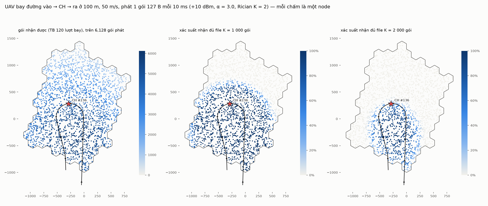
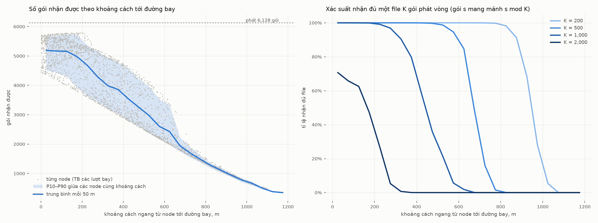
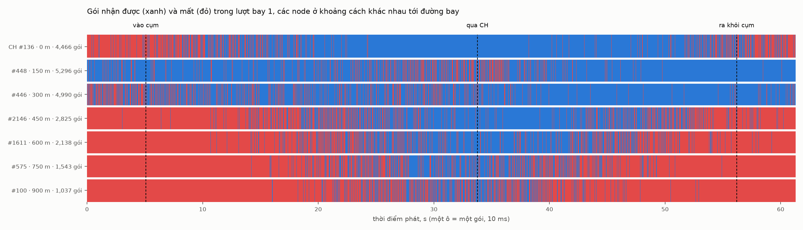

# Bước 3 — UAV bay xuyên cụm và phát tin: mỗi node nhận được bao nhiêu gói?

> Triển khai: seed 1, R = 100 m, 109 cell lồi hoàn toàn, spacing 35 m → **2 312 node**,
> CH #136 (cách biên 556 m), đường bay lần bốc 0 (xem [DEPLOY-vi.md](DEPLOY-vi.md)).
> Kênh và kịch bản phát giống thí nghiệm A2G-RUN / A2G-SWEEP của `uav-sar` (nhánh đô thị).
> **120 lượt bay độc lập.**

## Kịch bản

| | |
|---|---|
| đường bay | đoạn thẳng 255 m ngoài cụm → điểm vào → CH → điểm ra → đoạn thẳng 255 m; tổng **3 064 m** |
| UAV | cao 100 m, 50 m/s, **61 s** |
| phát | một PSDU 127 B có đánh số, **mỗi 10 ms**, từ đầu tới cuối đường bay: **6 128 gói** |
| vô tuyến | +10 dBm; độ nhạy −100 dBm; PHY trực tiếp, không MAC; mọi node luôn nghe |
| kênh | free space tới 100 m, sau đó α = 3.0; Rician K = 2, bốc lại cho mỗi gói và mỗi node |
| file | gói s mang mảnh **s mod K** (phát vòng): một lượt bay cho kết quả với mọi K |

Mỗi node, mỗi lượt bay ghi lại:
- số gói nhận được;
- chuỗi gói liên tiếp dài nhất (chỉ số của A2G-RUN);
- số mảnh khác nhau của file K gói đã nhận, và có đủ cả K mảnh không.

## Kết quả





Theo khoảng cách ngang từ node tới đường bay (trung bình 120 lượt bay):

| khoảng cách | node | gói nhận | chuỗi dài nhất | đủ K=200 | K=500 | K=1000 | K=2000 |
|---|---|---|---|---|---|---|---|
| 0–100 m | 419 | 5 181 | 824 | 100 % | 100 % | 100 % | 68 % |
| 100–200 m | 350 | 5 072 | 606 | 100 % | 100 % | 99.9 % | 55 % |
| 200–300 m | 273 | 4 486 | 331 | 100 % | 100 % | 98 % | 16 % |
| 300–400 m | 275 | 3 925 | 176 | 100 % | 100 % | 86 % | 0.4 % |
| 400–500 m | 237 | 3 399 | 100 | 100 % | 99.8 % | 47 % | 0 |
| 500–600 m | 204 | 2 792 | 60 | 100 % | 97 % | 14 % | 0 |
| 600–700 m | 143 | 2 207 | 38 | 100 % | 68 % | 1 % | 0 |
| 700–800 m | 155 | 1 596 | 24 | 99.9 % | 9 % | 0 | 0 |
| 800–900 m | 122 | 1 193 | 16 | 95 % | 0 | 0 | 0 |
| 900–1000 m | 97 | 878 | 11 | 52 % | 0 | 0 | 0 |
| 1000–1100 m | 33 | 608 | 7 | 3 % | 0 | 0 | 0 |
| 1100–1200 m | 4 | 365 | 5 | 0 | 0 | 0 | 0 |

Toàn cụm (2 312 node):

| file K | tỉ lệ node nhận đủ (TB) | node gần như chắc đủ (≥ 95 % lượt) | node không bao giờ đủ |
|---|---|---|---|
| 100 | 99.7 % | 99.2 % | 0 |
| 200 | 96.1 % | 92.2 % | 0.7 % |
| 500 | 80.6 % | 75.0 % | 12.5 % |
| 1 000 | 61.1 % | 49.7 % | 28.6 % |
| 2 000 | 22.7 % | 1.9 % | 60.0 % |

- **Mọi node đều nghe được gì đó.** Ít nhất 350 gói, trung vị 3 901 gói / 6 128.
  Cụm rộng khoảng 2 km, và ở α = 3.0 tầm phủ của A2G khoảng 1 km.
- **Số gói nhận gần như chỉ phụ thuộc vào thời gian UAV ở gần node**, không phụ thuộc vào
  lượt bay. Giữa các lượt bay, số gói của một node chỉ dao động khoảng ±0.6 %
  (CH: P10–P90 = 4 434–4 485), vì fading được bốc lại cho từng gói nên trung bình hoá
  trên hàng nghìn gói.
- **Thứ quyết định một file có nhận đủ không là các khe hở, không phải tổng số gói.**
  Node ở 0–100 m nhận trung bình 5 181 gói, gấp 2.6 lần file 2 000 gói, nhưng chỉ đủ
  file ở 68 % lượt bay.
  - Mất ngẫu nhiên do fading phân tán đều trên mọi mảnh. Với khoảng 3 vòng của file trong
    một lượt bay, thường vẫn còn 1–2 mảnh mà cả 3 lần phát đều rơi vào lúc mất.
  - Ví dụ CH: trung bình nhận 1 999.0 / 2 000 mảnh, nhưng chỉ đủ cả 2 000 mảnh ở 42.5 %
    lượt bay.
  - Đây chính là chỗ hợp tác tại biên có ích: mảnh còn thiếu gần như chắc chắn có ở một
    node lân cận.
- **CH nhận ít hơn các node cách đường bay 100–300 m** (4 458 so với ~5 000 gói). Đường
  bay của lần bốc 0 có hình chữ U: điểm vào và ra cùng ở mép nam. Node giữa hai nhánh chữ U
  ở gần cả hai nhánh, còn CH nằm ở đỉnh chữ U nên chỉ ở gần đường bay một quãng ngắn.
  Hình dưới cho thấy điều đó theo thời gian.



Dải trên: mỗi ô là một gói; xanh là nhận, đỏ là mất; lượt bay 1. Quanh lúc UAV bay qua, CH nhận
liền 715 gói không mất gói nào (7 s; trung bình 120 lượt bay là 835 gói). Node ở 150 m nằm giữa hai nhánh chữ U nên nhận tốt gần như
suốt cả lượt bay.

## Kiểm tra tự động (mỗi lượt bay)

- UAV phát đủ 6 128 gói, không gói nào lỗi; công suất phát đúng +10 dBm.
- Máy bay ở đúng vị trí kế hoạch tại mỗi gói (sai lệch < 5 cm); đường bay đọc từ CSV liền
  mạch (mẫu cách nhau ≤ 2 m); đường bay đi qua CH.
- Không gói trùng, không gói sai định dạng.
- Fading kênh áp vào khớp lý thuyết Rician K = 2:
  - công suất trung bình = 1 (sai số < 1 %);
  - P(fade < −10 dB) = 4.61 % (± 5 %), P(fade < −20 dB) = 0.409 % (± 10 %).
- Tính nhất quán: chuỗi dài nhất ≤ số gói nhận; số mảnh ≤ min(K, số gói); một chuỗi
  ≥ K thì có đủ file.
- Tái lập: mỗi lượt bay chỉ phụ thuộc (seed, số lượt). Lượt 2 chạy riêng cho kết quả
  trùng từng byte với lượt 2 chạy sau lượt 1. Nhờ vậy 120 lượt được chia cho 4 tiến trình.

## Giới hạn

- **Một đường bay, một bố trí.** Lần bốc 0 có điểm vào và ra gần nhau (đường chữ U), nên
  kết quả theo khoảng cách lẫn cả hình dạng đường bay.
- **Fading độc lập từng gói** (giống A2G-RUN): lạc quan so với kênh có thời gian kết hợp
  dài hơn, vì mất gói ở đó sẽ dồn thành cụm.
- **Không có che khuất tĩnh** giữa UAV và node; chỉ là mô hình đô thị trung bình.
- **Không có MAC, không có node nào phát:** chỉ có kênh A2G một chiều. Chưa có hợp tác
  G2G.

## Chạy lại

```bash
P=/home/user/ns3-dev/build/src/uav-coop/examples/ns3.46-uav-coop-pass-optimized
# trong docs/data (deploy-nodes-s35.csv, deploy-path-s35.csv), 4 tiến trình × 30 lượt (~65 phút)
for i in 0 1 2 3; do $P --firstRun=$((i*30+1)) --runs=30 --out=pass$((i+1)) & done; wait
python3 tools/pass_report.py --raw "pass*-raw.csv" --geom pass1-nodes.csv --strip pass1-strip.csv \
    --track pass1-track.csv --lattice docs/data/deploy-lattice.csv --data docs/data --figs docs/figures
python3 tools/pass_report.py --redraw --lattice docs/data/deploy-lattice.csv --data docs/data --figs docs/figures
```

Dữ liệu: `docs/data/pass-nodes.csv` (mỗi node, trên 120 lượt bay), `pass-bins.csv`,
`pass-strip.csv` (lượt 1, mọi node), `pass-track.csv` (vị trí UAV tại mỗi gói).
