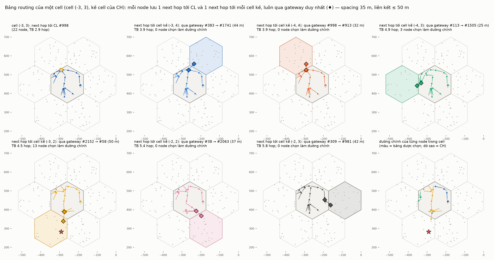
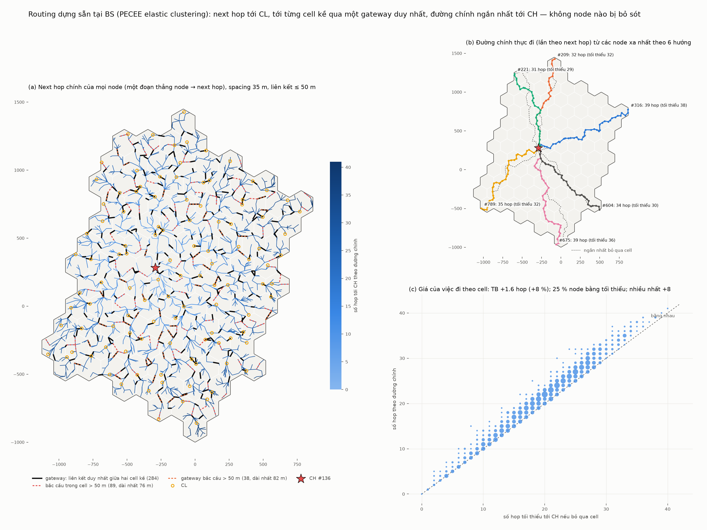

# Routing dựng sẵn — PECEE elastic clustering

> Cài lại trong `uav-coop` cơ chế routing trên lớp cell (cell, CL, gateway) đã dùng ở
> `uav-sar` (`cell-grid` và `inter-cell-routing`). Mã: `models/common/routing.{h,cc}`, chạy ở
> bước 6 của `uav-coop-deploy`. Bố trí seed 1 (109 cell, CH #136).

## Nguyên tắc

- **Tính tập trung tại BS** trước khi bay. **Không node nào được bị bỏ sót.**
- **Giữa hai cell kề chỉ có một đường:** một liên kết gateway a–b (a thuộc A, b thuộc B).
  Mọi dữ liệu từ A sang B, và chiều ngược lại, đều qua liên kết này.
- **Bên trong cell thì linh hoạt.**

## Liên kết

- **Liên kết thường:** hai node cách nhau ≤ **50 m** (`--linkRange`).
  - Đây là hop ngắn nhất của thí nghiệm G2G-CHAIN, biên trung vị 11.5 dB.
  - Ở 75 m biên chỉ còn 5.3 dB, ở 100 m còn 1 dB.
- **Liên kết bắc cầu** (dài hơn 50 m) được BS thêm vào ở hai chỗ để không node nào bị
  cô lập:
  - **Trong cell:** nếu đồ thị trong cell bị đứt, các mảnh được nối bằng những liên kết
    ngắn nhất có thể (cây khung nhỏ nhất giữa các mảnh, Kruskal). Nhờ vậy mọi node đều
    tới được CL và mọi gateway của cell mình mà không phải ra khỏi cell.
  - **Gateway:** nếu hai cell kề không có cặp node nào trong vòng 50 m, cặp gần nhất được
    nối làm gateway.

**Chọn gateway** cho mỗi cặp cell kề A–B: trong các cặp (a, b) cách nhau ≤ 50 m, chọn cặp
có ít hop nhất theo tổng a → CL(A) và b → CL(B), rồi đến cặp ngắn nhất. Cách chọn này
giống bản `uav-sar`, và đối xứng: A → B và B → A dùng cùng một liên kết.

## Mỗi node lưu gì

| bảng | next hop tới | đường đi |
|---|---|---|
| `toCL` | **CL của cell mình** | trong cell |
| `toCell[B]` | **cell kề B** (mỗi cell kề một bảng, tối đa 6) | trong cell tới gateway a, rồi a → b |
| **đường chính** | một trong các next hop trên, cái mở đầu **đường ngắn nhất tới CH** | — |

- **"Ngắn nhất"** là ít hop nhất; nếu bằng nhau thì ít mét hơn.
- **Đường chính:** mỗi node chỉ được chuyển tiếp theo một next hop *đã lưu của chính nó*,
  và đường chính là đường ngắn nhất trong ràng buộc đó (Dijkstra ngược từ CH). CH là CL
  của cell mình.
- **Không có vòng lặp:** mỗi hop trên đường chính giảm số hop còn lại đúng 1.
- **Chỉ qua cell ở gateway:** mọi lần đường chính đổi cell đều đi đúng liên kết gateway.
  Cả hai điều này được kiểm cho mọi node.

## Bảng của một cell



Ví dụ cell (−3, 3), kề cell của CH:
- Mỗi cell kề có một gateway (♦), và mọi node trong cell đều đi về đúng gateway đó.
- Gateway thường nằm gần CL vì luật chọn ưu tiên ít hop tới CL. Với cell (−4, 4),
  gateway chính là CL #998.
- Ở ô cuối:
  - 13 node đi thẳng sang cell của CH qua gateway #2152 → #58;
  - 3 node đi vòng qua cell (−4, 3);
  - vài node đi về CL trước, vì từ CL ra gateway cũng ngắn bằng.

## Đường tới CH



| spacing | node | bậc TB | tới được CH | hop TB (tối đa) | so với tối thiểu bỏ qua cell | gateway | liên kết bắc cầu (dài nhất) |
|---|---|---|---|---|---|---|---|
| 20 m | 7 080 | 19.0 | **100 %** | 19.2 (41) | +16 % | 284 | 0 |
| 35 m | 2 312 | 6.3 | **100 %** | 21.1 (41) | +8 %, tệ nhất +8 hop | 284 | 127: 89 trong cell, 38 gateway (82 m) |
| 50 m | 1 133 | 3.7 | **100 %** | 19.2 (36) | +5 % | 284 | 375 (136 m) |

- (a) Mỗi đoạn thẳng nối một node với next hop chính của nó, tạo thành một cây hướng về
  CH. Nét đen đậm là 284 gateway, nét đứt là các liên kết bắc cầu.
- (b) Đường thực đi từ 6 node xa nhất: lệch so với đường ngắn nhất bỏ qua cell 0–4 hop.
- (c) Ở 35 m: trung bình +1.6 hop (+8 %); 25 % node đi đúng số hop tối thiểu.

**Ở 20 m, cái giá của gateway duy nhất cao hơn** (+16 %): mạng dày nên đường tự do rất
thẳng, còn mọi đường đều phải gom về một điểm qua cell.

## Liên kết bắc cầu là liên kết yếu

| spacing | liên kết bắc cầu | > 67 m | > 75 m | > 100 m | node có đường chính đi qua ít nhất một cầu |
|---|---|---|---|---|---|
| 35 m | 127 | 17 | 2 | 0 | **83 %** |
| 50 m | 375 | 145 | 99 | 20 | **98 %** |

- **Ở 35 m:** các cầu chủ yếu dài 50–67 m, vẫn còn khoảng 6–11 dB biên trung vị. Nhưng
  chúng nằm trên đường chính của phần lớn node: gateway và các node giữa cell là chỗ mọi
  đường đều đi qua.
- **Ở 50 m:** có 20 cầu dài hơn 100 m. Theo quỹ đường truyền G2G, ở 100 m chỉ còn 1 dB,
  và chuỗi G2G thực tế gần như tắc.

## Kiểm tra tự động (31 triệu CHECK, tất cả qua)

- **Liên kết:** so với duyệt mọi cặp node, đúng tập (cặp ≤ 50 m) ∪ (cầu đã liệt kê), hai
  chiều. Mỗi cầu dài hơn 50 m và nối đúng loại (cùng cell, hoặc hai cell kề).
- **Gateway:**
  - đúng một cho mỗi cặp cell kề, đối xứng;
  - đúng là cặp tốt nhất theo luật chọn;
  - là cầu khi và chỉ khi không có cặp nào trong vòng 50 m.
- **`toCL`:** mọi node tới được CL trong cell. Số hop bằng BFS độc lập; đi lần từng hop.
- **`toCell[B]`:** số hop bằng (BFS tới gateway a) + 1; đi lần thì ở trong A tới đúng a,
  rồi đúng một hop a → b.
- **Đường chính:**
  - mọi node đều có;
  - đi lần: tới đúng CH, mỗi hop giảm 1, mọi lần đổi cell đều đúng liên kết gateway;
  - không ngắn hơn đường bỏ qua cell;
  - thoả phương trình Bellman trên các next hop đã lưu.

## Điểm cần chốt

- **Tầm liên kết 50 m** là giá trị tôi tự chọn.
  - Ở 35 m nó buộc phải thêm 127 cầu, và 83 % đường chính đi qua ít nhất một cầu.
  - Tăng lên 60–67 m sẽ bớt cầu nhưng mọi liên kết đều yếu hơn.
  - Một cách khác: tính chi phí theo độ dài liên kết, để đường chính tránh cầu khi có
    thể.
- **Luật chọn gateway** đang ưu tiên ít hop tới CL, nên gateway thường là liên kết dài
  (gần 50 m). Có thể ưu tiên liên kết ngắn trước.
- **Liên kết đang là hình học.** Kênh G2G thật có che khuất tĩnh σ = 7.8 dB.

## Chạy lại

```bash
B=/home/user/ns3-dev/build/src/uav-coop/examples/ns3.46-uav-coop-deploy-optimized
$B --spacings=20,35,50 --linkRange=50 --out=deploy     # ghi deploy-routes/gateways/bridges-sS.csv
python3 tools/route_figures.py docs/data docs/figures --spacing 35 --range 50
```

- `deploy-routes-sS.csv`: mỗi dòng là một node, với các cột:
  - bậc;
  - `toCL` (next hop, số hop);
  - next hop chính và bảng được chọn (`CL` hoặc `q:r` của cell kề);
  - số hop và số mét tới CH, số hop tối thiểu bỏ qua cell;
  - `toCells` = `q:r>next/hops|…`.
- `deploy-gateways-sS.csv`: mỗi cặp cell kề một dòng: gateway hai phía, độ dài, có phải
  cầu không.
- `deploy-bridges-sS.csv`: các liên kết bắc cầu.
