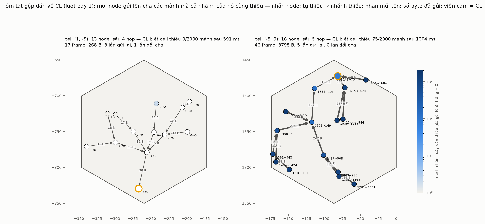
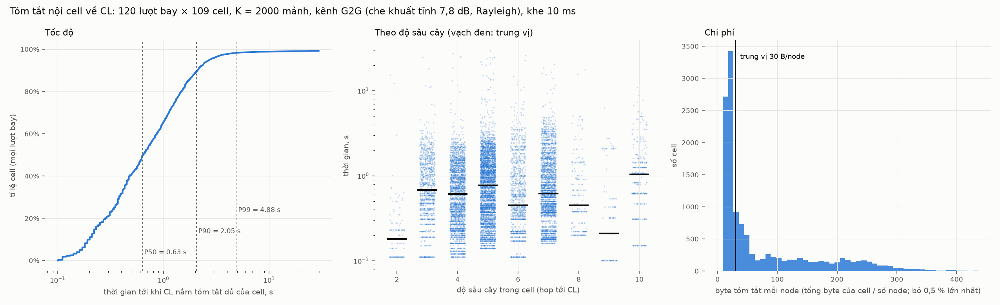

# Bước 4 — Tóm tắt nội cell về CL

> Góc nhìn: bên trong **một cell**, ngay sau khi UAV bay qua. Mỗi node có một phần file
> (K = 2 000 mảnh, gói s mang mảnh s mod K). CL cần một bản tóm tắt ngắn: **cell có gì và
> thiếu gì**, để chuẩn bị quyết định manifest. Chưa có trao đổi dữ liệu, chưa chạm sang
> cell khác. Mã: `examples/coop-summary.cc`, `models/common/manifest.{h,cc}`.

## Ý tưởng: gửi phần thiếu, và gộp dần trên đường về CL

CL không cần biết từng node có gì, chỉ cần **hợp** của chúng. Gọn hơn nữa: cần biết các
mảnh **không node nào có** (cell thiếu). Tập này là một **giao**, nên gộp được dần dọc
theo cây `toCL` của routing dựng sẵn:

```
mỗi node gửi lên cha:   thiếu(nhánh) = thiếu(chính nó) ∧ thiếu(nhánh con 1) ∧ thiếu(nhánh con 2) ∧ ...
```

Tập này co lại rất nhanh trên đường lên: ở gần CL nó thường rỗng (xem hình dưới, nhãn
"tự thiếu → nhánh thiếu").



- **Trái — cell gần đường bay:** mọi node đều thiếu rất ít. Mỗi tóm tắt chỉ 15–30 B; CL
  biết cell không thiếu gì sau 591 ms.
- **Phải — cell xa đường bay:** các lá thiếu 1 300–1 700 mảnh, mỗi lá gửi 250–360 B. Lên
  tới CL, phần thiếu chỉ còn 75 mảnh: đó chính là danh sách cell thiếu.

## Gói tóm tắt

| phần | kích thước |
|---|---|
| loại, nguồn, đích, số thứ tự, cờ "đã gửi đủ" | 5 B |
| **mặt nạ các node đã được tính** (1 bit mỗi node trong cell) | ⌈n/8⌉ B (cell ≤ 36 node: ≤ 5 B) |
| manifest các mảnh nhánh thiếu, cho một đoạn [a, b) của file | 8 B header + nội dung |

- **Nội dung manifest** là cách ngắn nhất trong ba cách:
  - danh sách mảnh **thiếu**, mã Rice khoảng cách giữa các chỉ số;
  - danh sách mảnh **có**, mã Rice tương tự;
  - **bitmap** của đoạn.
- **Nhánh không thiếu gì** thì cả file gói trong 1 frame khoảng 15 B.
- **Lá thiếu nhiều** cần 2–3 frame, mỗi frame ≤ 100 B. Mỗi frame mô tả trọn một đoạn
  [a, b) của file, nên mất một frame chỉ mất đúng đoạn đó.
- **Mặt nạ, không phải số đếm.** Một node chuyển sang cha khác có thể được hai cha cùng
  tính. Gộp bằng phép OR thì nó vẫn chỉ được tính một lần. Bản đầu dùng số đếm và đã đếm
  trùng; phần kiểm tra tự động bắt được lỗi này.

## Cách gửi

- **Lịch:** BS lập sẵn cùng routing. Mỗi lúc chỉ một node trong cell phát; khe 10 ms
  theo thứ tự hậu tự của cây (con trước cha), lặp theo vòng.
- **Unicast có ACK:** node gửi frame tiếp theo cho cha, cha ACK ngay trong khe. Không có
  ACK thì vòng sau gửi lại đúng frame đó.
- **Chờ con:** node bắt đầu gửi khi mọi con đã gửi đủ. Nếu một con im lặng 3 vòng cho mỗi
  tầng bên dưới nó, node gửi với những gì đang có, để một liên kết chết không làm kẹt cả
  cell. Con gửi tới muộn thì node gửi lại tóm tắt đã cập nhật.
- **Tự sửa cây:** cây được lập theo khoảng cách, nhưng che khuất tĩnh có thể làm chết
  một liên kết trong kế hoạch. Sau 3 lần mất ACK liên tiếp, node chuyển sang một cha khác:
  - trong tầm 1.5 × 50 m;
  - gần CL hơn theo thứ tự (số hop, id), nên không thể tạo vòng.
- **Kênh:** mỗi cell một kênh riêng, vì PECEE tô màu để cell kề khác kênh. Kênh G2G của
  G2G-CHAIN: n = 3.5, che khuất tĩnh 7.8 dB cho từng cặp, Rayleigh giữ trong 100 ms;
  +10 dBm.

## Kết quả: 120 lượt bay × 109 cell = 13 080 lần tóm tắt



| | |
|---|---|
| **CL nắm chính xác cell có/thiếu gì** | **99.24 %** (12 980 / 13 080) |
| thời gian tới CL | **trung vị 0.63 s**, p90 2.05 s, p99 4.9 s, tối đa 29 s |
| byte mỗi cell | trung vị 701 B (khoảng 30 B mỗi node), p90 4.7 kB |
| frame mỗi cell | trung vị 26, p90 55 |
| cell thiếu ít nhất một mảnh | 3.9 % số lần; khi thiếu thì trung vị 4 mảnh, tối đa 101 |
| không che khuất, không fading (`--selftest`) | 100 % chính xác |

- **Phân bố byte có hai đỉnh:**
  - cell gần đường bay: khoảng 15–40 B mỗi node, chủ yếu là header;
  - cell xa đường bay: 100–300 B mỗi node, vì lá thiếu nhiều nên tóm tắt của nó dài.
- **Thời gian không tăng theo độ sâu cây**, vì lịch đi từ lá lên gốc trong cùng một vòng.
  Thời gian phụ thuộc vào số vòng phải lặp: lá cần 3 frame thì cần 3 vòng, cộng thêm các
  lần gửi lại.
- **0.19 % node (539 / 288 k) không gửi được tóm tắt về CL** trong 30 s. Đó là node mà mọi
  liên kết, kể cả cha thay thế, đều chết. Có vài lần gần cả cell không tới được CL (thiếu
  20–25 node): chính CL bị che khuất với mọi node xung quanh.
- **Khi thiếu node, CL vẫn đúng ở 78 / 100 lần**, vì mảnh của node vắng mặt đã có ở node
  khác. 22 lần còn lại CL tưởng cell thiếu nhiều hơn thực tế. CL **không bao giờ** tưởng
  cell có mảnh mà thực ra không có (được kiểm cho mọi lần).

## Kiểm tra tự động (~1.1 × 10⁹ CHECK, tất cả qua)

- **Mã hoá:** mỗi frame tóm tắt được giải mã lại và so khớp từng mảnh của đoạn.
- **Cây:**
  - cây `toCL` nằm trọn trong cell;
  - đi hậu tự gặp mỗi node đúng một lần;
  - cha thay thế luôn gần CL hơn theo (hop, id).
- **Kết quả ở CL:**
  - phần thiếu CL biết luôn ⊇ phần thiếu thật;
  - khi mặt nạ phủ đủ mọi node thì phải bằng đúng phần thiếu thật;
  - frame "đã gửi đủ" phải phủ cả file.

## Có thể nhanh hơn nữa

- **Hỏi từ trên xuống.** CL (hoặc mỗi cha) phát trước tập mình đang thiếu; con chỉ trả
  lời trên tập đó. Lá xa đường bay khi đó không phải gửi 2–3 frame phần thiếu của chính
  nó: tập cần hỏi thường chỉ vài chục mảnh, đủ trong 1 frame nhỏ. Đây là chi phí lớn
  nhất hiện nay.
- **Khe 6 ms thay vì 10 ms** (frame + ACK vẫn vừa) sẽ giảm thời gian khoảng 40 %.
- **Bầu lại CL khi CL bị cô lập với cả cell:** đây là nguyên nhân của các lần thiếu 20+
  node.

## Chạy lại

```bash
# 1. bitmap nhận gói của 120 lượt bay (khoảng 1.5 giờ, 3 tiến trình)
P=/home/user/ns3-dev/build/src/uav-coop/examples/ns3.46-uav-coop-pass-optimized
for i in 0 1 2; do $P --nodes=deploy-nodes-s35.csv --path=deploy-path-s35.csv \
    --firstRun=$((i*40+1)) --runs=40 --bits --out=p$((i+1)) & done; wait
for f in p*-bits-r*.bin; do ln -sf $f bits-r${f##*-r}; done
# 2. tóm tắt nội cell (khoảng 1.5 phút cho 120 lượt)
S=/home/user/ns3-dev/build/src/uav-coop/examples/ns3.46-uav-coop-summary-optimized
$S --nodes=deploy-nodes-s35.csv --routes=deploy-routes-s35.csv --bits=bits-r{r}.bin --runs=120 --out=summary
$S ... --selftest --out=summary-selftest
python3 tools/summary_report.py docs/data docs/figures
```

Lượt bay của bước 1 tái lập được: 120 lượt chạy lại khớp từng dòng với chiến dịch của
PASS-vi.md. Dữ liệu trong `docs/data/`:
- `summary-cells.csv`: mỗi lượt bay × cell;
- `summary-nodes.csv`: lượt 1, mỗi node: cha cuối cùng, byte đã gửi, tự thiếu → nhánh
  thiếu;
- `summary-selftest-cells.csv`.
