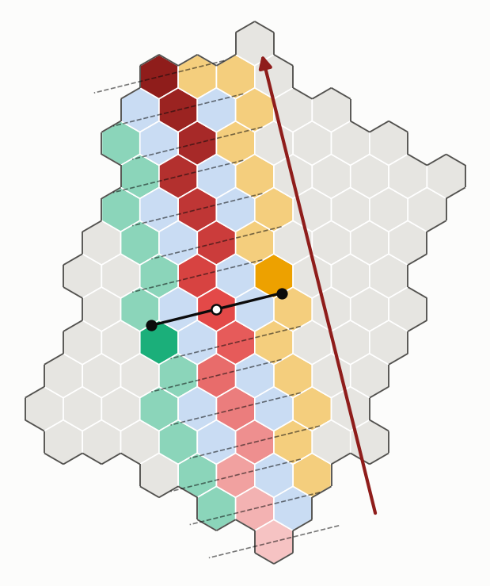
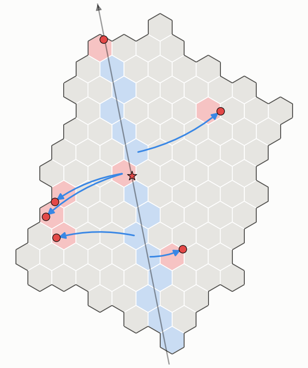
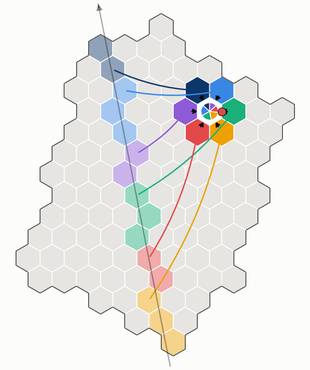

# Lớp 3: định tuyến trên mặt đất sau lượt bay (River)

Mô tả gốc của người dùng: CLAUDE.md §8, mục 38–45. Phạm vi: Pha 1, một cụm, đường bay
thẳng, đơn vị là cell.

## 1. Bài toán

UAV bay qua cụm **một lần** theo đường bay $\gamma$ và phát liên tục: gói $s$ được phát tại toạ
độ đường bay $d_s=d_0+s\Delta$, với $\Delta=v\tau$ (0,5 m mỗi gói ở 50 m/s, 10 ms). Mỗi node
nhận gói $s$ với xác suất $1-p(\rho)$, trong đó $\rho$ là khoảng cách ngang tới $\gamma(d_s)$ và
$p(\cdot)$ là đường PER đo từ ns-3. Vì $\gamma$, $d_s$ và $p$ đều biết trước, **kế hoạch được lập
trước giờ bay**.

Sau lượt bay, CL của mọi critical cell phải giữ đủ mọi gói được phát trong cụm, với thời gian
hoàn tất nhỏ nhất. Ràng buộc:
- radio bán song công;
- giữa hai cell kề nhau chỉ đi qua một gateway;
- dữ liệu chỉ đi theo cell path đã định.

Gói phát ngoài cụm không được giao cho ai, nhưng cell nào nhận được thì vẫn lưu lại và gửi khi
được hỏi.

| ký hiệu | nghĩa |
|---|---|
| $\mathrm{Cells}$, $z(c)$, $\mathrm{Neig}(c)$ | các cell của cụm; tâm của cell $c$; các cell kề $c$ trong cụm |
| $\mathrm{Ring}_r(c)$ | các cell cách $c$ đúng $r$ bước; $\mathrm{Ring}_1=\mathrm{Neig}$ |
| $\mathrm{score}(c)$ | điểm năng lực của CL của cell $c$ (quan sát × tính toán × giao tiếp) |
| $\mathrm{Axe}=(a_1,\dots,a_n)$ | các cell mà $\gamma$ cắt qua, theo thứ tự bay |
| $\mathrm{Seg}(a)$ | đoạn dữ liệu của cell Axe $a$: các gói phát khi UAV ở trên $a$ |
| $u$, $\omega$ | hướng của Axe; nửa bề rộng River, chọn để River rộng 3–4 cell, tức $p(\omega)\approx1\,\%$ |
| $\mathrm{Bank}_{\pm}(a)$, $\mathrm{Path}_{\pm}(a)$ | hai Bank mà $a$ phục vụ, và cell path từ $a$ tới mỗi Bank |
| $\mathrm{River}$ | hợp các $\mathrm{Path}$ |
| $\mathrm{Crit}$ | critical cells: cell của CH và các cell có CL vượt trội |
| $\mathrm{Circ}(k)$ | Circle của critical cell $k$: các cell phục vụ $k$, mỗi cell giữ sẵn một phần dữ liệu |

## 2. Mã giả ngắn

```text
Algorithm 1  AXETABLE                                   ▷ BS, before the flight
1: Axe ← cells crossed by γ, in flight order
2: for each a ∈ Axe do  Seg(a) ← { s : γ(d0 + sΔ) ∈ a }
3: send { (a, Seg(a)) } and u to CH; CH gives every Axe cell its row
```

```text
Algorithm 2  RIVERSETUP(a)                              ▷ each Axe cell a
1: n ← u rotated by 90°
2: for σ ∈ {+1, −1} do
3:     Path_σ(a) ← cells on the segment z(a) → z(a) + σ·ω·n, cut at the cluster edge
4:     Bank_σ(a) ← last cell of Path_σ(a)
```

```text
Algorithm 3  CRITICAL                                   ▷ CH, before the flight
1: μ, σ ← mean, std of score(c) over Cells
2: Crit ← {cell of CH}
3:     ∪ { c : score(c) > μ + κ_g·σ }                           ▷ outstanding in the cluster
4:     ∪ { c : score(c) > μ + κ_l·σ and score(c) = max over c and its r-ring }   ▷ … in its area
```

```text
Algorithm 4  CIRCLE(k)                                  ▷ CH, for every k ∈ Crit
1: Circ(k) ← Neig(k), ordered along u
2: split Axe into |Circ(k)| consecutive groups; neighbour j takes group G_j
3: for each j: fetch ⋃_{a ∈ G_j} Seg(a) from the nearest Bank of G_j along a cell path,
4:             keep it, hand it to k when k asks
```

Bộ tham số dùng trong các hình: $\kappa_g=2$, $\kappa_l=1$, $r=2$.

## 3. Mã giả đầy đủ

### Thuật toán 1: bảng Axe (tại BS, trước giờ bay)

```text
Algorithm 1  AXETABLE(γ, d0, Δ, N)
1: Axe ← ()                                         ▷ ordered list
2: for s ← 0 to N−1 do
3:     c ← cell containing γ(d0 + sΔ)
4:     if c ∉ Cells then continue                   ▷ sent outside the cluster: no owner
5:     if c ∉ Axe then append c to Axe; Seg(c) ← ∅
6:     Seg(c) ← Seg(c) ∪ {s}                        ▷ straight path: an interval [first, last]
7: u ← unit( z(a_n) − z(a_1) )                      ▷ the Axe's sum vector
8: send header (d0, Δ, N, u, ω) and rows { (a_i, first(Seg(a_i)), last(Seg(a_i))) } to CH
9: CH forwards row i to Axe cell a_i
```

### Thuật toán 2: thiết lập River (tại mỗi cell Axe)



Cách đọc hình:
- mũi tên đỏ sẫm: vector tổng $u$ của Axe;
- chấm trắng: cell trung tâm;
- đường liền: đường vuông góc qua cell trung tâm, với hai chấm đen nằm cách nó $\omega$;
- hai cell xanh lá đậm và cam đậm: hai Bank của cell trung tâm;
- đường đứt: các đường song song qua những cell Axe khác;
- xanh lá nhạt và vàng: các Bank còn lại;
- xanh nhạt: River.

```text
Algorithm 2  RIVERSETUP(a, u, ω)
1: n ← (−u_y, u_x)                                  ▷ the same normal for every a: parallel lines
2: for σ ∈ {+1, −1} do
3:     Path_σ(a) ← (a)
4:     for t ← 0 to ω step w/20 do                  ▷ w: cell width
5:         c ← cell containing z(a) + σ·t·n
6:         if c ∉ Cells then break                  ▷ River reaching the edge: the edge is the Bank
7:         if c ≠ last(Path_σ(a)) then append c to Path_σ(a)
8:     Bank_σ(a) ← last(Path_σ(a))
9: River ← ⋃_{a ∈ Axe, σ} Path_σ(a)
```

Trên đường bay thẳng của cụm thử ($W=3{,}5$, $\omega=303$ m, $p(\omega)=1{,}1\,\%$):
- Axe có 15 cell, River 58 cell, Banks 26 cell (12 / 14 hai bên);
- 6 trong 30 Bank là cell biên cụm.

### Thuật toán 3: node vượt trội và critical cells (tại CH, trước giờ bay)



```text
Algorithm 3  CRITICAL(Cells, score, κ_g, κ_l, r)
1: μ ← mean_{c ∈ Cells} score(c);  σ ← std_{c ∈ Cells} score(c)
2: Crit ← { cell of CH }                            ▷ always critical
3: for each c ∈ Cells do
4:     if score(c) > μ + κ_g·σ then                 ▷ far above the whole cluster
5:         Crit ← Crit ∪ {c}
6:     else if score(c) > μ + κ_l·σ and
7:             score(c) ≥ max { score(c') : c' ∈ Ring_1(c) ∪ … ∪ Ring_r(c) } then
8:         Crit ← Crit ∪ {c}                        ▷ the best of its area, and well above average
9: return Crit
```

Trong cụm thử, với $\kappa_g=2$, $\kappa_l=1$ và $r=2$, có 7 critical cell: cell của CH, 2 cell
vượt trội toàn cụm và 4 cell vượt trội trong khu vực của mình.

### Thuật toán 4: Circle (tại CH, cho mỗi critical cell)



Cách đọc hình:
- nét đứt: đoạn Axe thứ j bổ sung cho Bank;
- nét liền: hàng xóm thứ j kéo dữ liệu từ Bank về theo cell path;
- nét chấm: hàng xóm giao cho critical cell khi được yêu cầu;
- hình tròn chia màu ở giữa: phần dữ liệu của từng hàng xóm.

```text
Algorithm 4  CIRCLE(k, Axe, Seg, Bank, Path)
1: Circ(k) ← Neig(k)                                ▷ 6 cells; fewer at the cluster edge
2: order Circ(k) = (m_1..m_q) by ⟨z(m_j), u⟩         ▷ further along the flight → later data
3: split (a_1..a_n) into q consecutive groups G_1..G_q of near-equal size
4: for j ← 1 to q do
5:     D_j ← ⋃_{a ∈ G_j} Seg(a)                     ▷ the share m_j holds for k
6:     b_j ← argmin_{b ∈ { Bank_±(a) : a ∈ G_j }} hops(b, m_j)
7:     P_j ← shortest cell path b_j → m_j avoiding Axe and k
8:     assign (D_j, b_j, P_j) to m_j
9: after the pass: m_j fetches D_j from b_j along P_j and keeps it;
10:                when k asks for X ⊆ D_j, m_j sends X to k
```

Một critical cell nằm trong River (ví dụ cell của CH, nằm trên Axe) vẫn dựng Circle như mọi
critical cell khác, vì nó cũng chỉ nhận được một đoạn dữ liệu.
