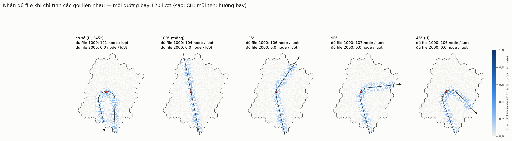
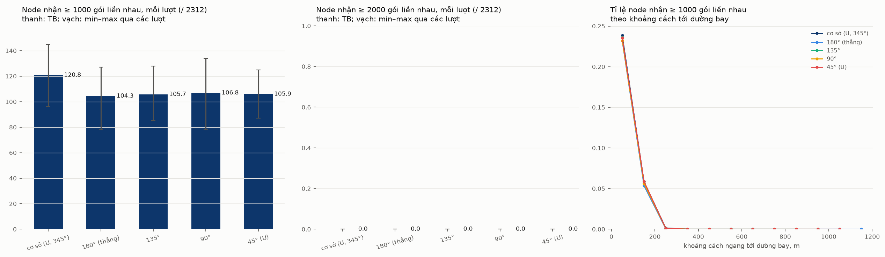

# Đủ file chỉ khi nhận các gói liền nhau, và độ cong của đường bay

> **Quy tắc:** một node có file K gói khi nó nhận được ít nhất K gói **liền nhau**. Các gói
> rời rạc không ghép thành file: 3 000 gói rải rác vẫn không thành một file 1 000 gói.
> Chỉ số đo là chuỗi gói liền nhau dài nhất của node trong một lượt bay (`maxRun` của
> `uav-coop-pass`).
>
> **Kịch bản:** mạng, kênh và cách phát giống [STATE-vi.md](STATE-vi.md):
> - 2 312 node, CH #136;
> - UAV cao 100 m, bay 50 m/s, phát 1 gói mỗi 10 ms;
> - kênh α = 3.0, Rician K = 2 (bốc lại cho từng gói).
>
> Mỗi đường bay chạy **120 lượt bay độc lập**.

## Tham số độ cong: `--angle`

Điểm vào lấy theo `--pick`. Điểm ra là chỗ tia đi từ CH cắt biên ngoài của cụm; tia này
quay một góc `--angle` (độ, ngược chiều kim đồng hồ) so với hướng từ CH tới điểm vào.

| `--angle` | hình dạng | dài trong cụm (vào → CH → ra) |
|---|---|---|
| 180° | thẳng xuyên qua CH | 2 304 m |
| 135° | gãy nhẹ | 2 318 m |
| 90° | rẽ vuông | 2 333 m |
| 45° | chữ U (rẽ trái) | 2 362 m |
| không đặt (cơ sở, lần bốc 0) | chữ U (rẽ phải), tương đương khoảng 345° | 2 555 m |

```bash
uav-coop-deploy --cells=60 --convexity=1 --spacings=35 --seed=1 --pick=0 --angle=90 --out=a90
```

Khi không đặt `--angle`, điểm ra vẫn bốc ngẫu nhiên như trước. Đầu ra trùng với dữ liệu cũ
từng byte (đã kiểm tra).

## Kết quả





| đường bay | node đủ file **1 000** / lượt (TB, min–max) | đủ ở ≥ 1 lượt | node đủ file **2 000** | chuỗi dài nhất từng gặp | trung vị chuỗi dài nhất |
|---|---|---|---|---|---|
| cơ sở (U, 345°) | **120,8** (96–145) | 736 | **0** | 1 995 | 170 |
| 180° (thẳng) | **104,3** (78–127) | 704 | **0** | 1 743 | 174 |
| 135° | **105,7** (85–128) | 705 | **0** | 1 691 | 184 |
| 90° | **106,8** (78–134) | 717 | **0** | 1 856 | 192 |
| 45° (U) | **105,9** (87–125) | 694 | **0** | 1 823 | 194 |

- **File 2 000 gói: không node nào nhận đủ, trên mọi đường bay và trong cả 600 lượt bay.**
  Chuỗi dài nhất từng gặp là 1 995 gói.
- **File 1 000 gói: chỉ khoảng 4,5–5 % số node đủ file mỗi lượt.**
  - Không node nào đủ ở ≥ 95 % số lượt. Node tốt nhất chỉ đủ ở 47 % số lượt.
  - Node đủ file nằm sát đường bay. Trong vòng 100 m quanh đường bay, chỉ khoảng 23 % node
    đủ file mỗi lượt. Ở 100–200 m còn 5–6 %; từ 200 m trở ra gần như không có.
- **Độ cong gần như không ảnh hưởng.**
  - Các đường bay mới cho kết quả trong khoảng 104–107 node.
  - Đường cơ sở được 121 node chỉ vì nó dài hơn khoảng 10 %, nên có nhiều node nằm gần
    đường bay hơn (419 node trong vòng 100 m, so với 357–373 ở các đường còn lại).
  - Tính theo khoảng cách tới đường bay, xác suất đủ file của mọi đường bay trùng nhau.
- **Giới hạn đến từ kênh, không đến từ hình học đường bay.**
  - Fading Rician (K = 2) được bốc lại cho từng gói. Vì vậy ngay cả node nằm ngay dưới UAV
    cũng thỉnh thoảng mất một gói, và chuỗi bị đứt.
  - Node trong vòng 100 m có chuỗi dài nhất trung bình khoảng 820 gói, ở mọi đường bay.
  - Muốn có 2 000 gói liền nhau (20 s) thì tỉ lệ mất gói phải nhỏ hơn khoảng 1 / 2 000
    trong suốt quãng đó.

So với cách đếm cũ (gộp gói rời rạc theo s mod K, xem [STATE-vi.md](STATE-vi.md)):
với K = 2000, số node đủ file giảm từ 22,7 % xuống 0 %.

## Chạy lại

```bash
D=/home/user/ns3-dev/build/src/uav-coop/examples/ns3.46-uav-coop-deploy-optimized
P=/home/user/ns3-dev/build/src/uav-coop/examples/ns3.46-uav-coop-pass-optimized
for a in 180 135 90 45; do
  $D --cells=60 --convexity=1 --spacings=35 --seed=1 --pick=0 --angle=$a --out=a$a
  mkdir -p pass$a
  for i in 0 1 2 3; do (cd pass$a && $P --nodes=../a$a-nodes-s35.csv --path=../a$a-path-s35.csv \
      --firstRun=$((i*30+1)) --runs=30 --out=p$((i+1))) & done; wait     # ~35 min per angle
done
cd /home/user/wsn-uav/uav-coop2
python3 tools/runs_report.py --deploy ../uav-coop/docs/data --data docs/data --figs docs/figures \
    "cơ sở (U, 345°)|BASE/p?-raw.csv|docs/data/path-base.csv" \
    "180° (thẳng)|pass180/p?-raw.csv|docs/data/path-a180.csv" "135°|pass135/p?-raw.csv|docs/data/path-a135.csv" \
    "90°|pass90/p?-raw.csv|docs/data/path-a90.csv" "45° (U)|pass45/p?-raw.csv|docs/data/path-a45.csv"
```

`BASE` là thư mục chứa các file -raw.csv của lượt chạy đường cơ sở trong `uav-coop`
(xem PASS-vi.md).

Dữ liệu:
- `docs/data/runs-paths.csv`: mỗi đường bay;
- `runs-nodes.csv`: mỗi đường bay và mỗi node (khoảng cách, chuỗi dài nhất, xác suất đủ file);
- `path-*.csv`, `pathwp-*.csv`: các đường bay.
