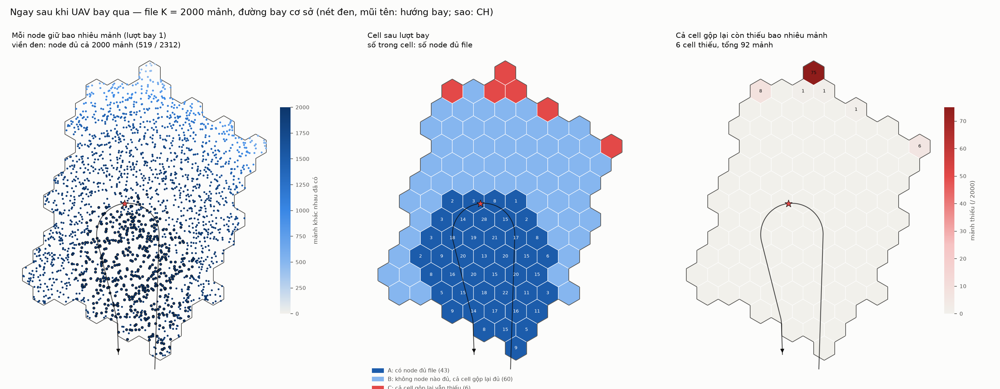
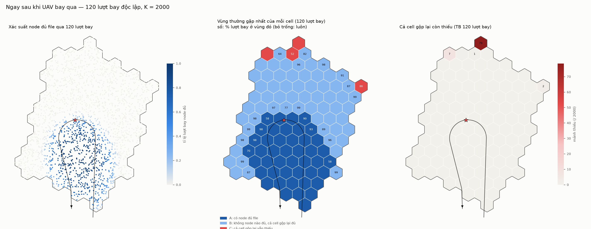

# Bước 0: tình huống ngay sau khi UAV bay qua cụm

> Mạng, đường bay và kịch bản phát giống hệt `uav-coop` ([PASS-vi.md](../../uav-coop/docs/PASS-vi.md)).
>
> - Triển khai: seed 1, 109 cell lục giác (R = 100 m), spacing 35 m, **2 312 node**.
> - CH #136 cách biên 556 m.
> - Đường bay: đường Dubins mở, vào cụm từ biên phía nam, đi qua CH rồi ra lại phía nam (hình chữ U).
> - UAV: cao 100 m, bay 50 m/s, phát gói 127 B mỗi 10 ms (6 128 gói); kênh α = 3.0, Rician K = 2.
> - **File K = 2 000 mảnh.** Gói thứ s mang mảnh s mod K.
> - **120 lượt bay độc lập.**
>
> Thời điểm khảo sát: UAV vừa rời cụm, chưa có trao đổi nào giữa các node.

## Phân loại cell

| vùng | điều kiện |
|---|---|
| **A** | ít nhất một node trong cell giữ đủ K mảnh |
| **B** | không node nào đủ, nhưng gộp tất cả node trong cell lại thì đủ |
| **C** | gộp cả cell lại vẫn còn thiếu mảnh |

## Một lượt bay (lượt 1)



## Qua 120 lượt bay



### Node

| | |
|---|---|
| node giữ đủ 2 000 mảnh | trung bình **524 / 2 312 (22,7 %)**; dao động 495–551 giữa các lượt |
| node chưa bao giờ đủ trong 120 lượt | **1 387 (60 %)** |
| node đủ ở ≥ 95 % số lượt | 43 (1,9 %) |
| CL đủ file | 39 / 109 CL đủ ở ít nhất một lượt; không CL nào đủ ở mọi lượt |
| CH | đủ ở 42,5 % số lượt; trung bình 1 999 / 2 000 mảnh |

Phân bố số mảnh mỗi node có ở lượt 1:

| số mảnh | < 500 | 500–999 | 1 000–1 499 | 1 500–1 899 | 1 900–1 999 | đủ 2 000 |
|---|---|---|---|---|---|---|
| số node | 10 | 133 | 246 | 358 | 1 046 | 519 |

- **Số node đủ file ít, nhưng phần lớn node gần đủ.** Trung vị của các node chưa đủ là 1 950 mảnh, tức chỉ thiếu khoảng 50 mảnh.
  - Node đủ nằm trong dải khoảng 300 m quanh đường bay.
  - Càng xa đường bay, số mảnh càng giảm. Node ít nhất có 316 mảnh, ở đỉnh phía bắc.

### Cell

| vùng | số cell mỗi lượt (TB, min–max) | node tốt nhất trong cell giữ (trung vị, min) |
|---|---|---|
| A | **43,3** (40–46) | đủ |
| B | **61,5** (57–65) | 97 %, 47 % |
| C | **4,2** (2–7) | 50 %, 32 % |

- **Vùng A:** dải cell dọc theo đường bay và quanh CH, khá ổn định giữa các lượt bay.
  - Cell ở mép dải dao động giữa A và B, khoảng 58–99 % số lượt ở A.
- **Vùng B chiếm phần lớn cụm.** Mỗi node chỉ giữ một phần, nhưng cả cell gộp lại thì đủ. Phần thiếu chỉ có thể bù bằng trao đổi trong cell.
- **Vùng C:** vài cell ở đỉnh phía bắc và mép đông bắc, xa đường bay nhất.
  - Trung vị cell C thiếu 4 mảnh; tệ nhất thiếu 101 mảnh. Cell ở đỉnh phía bắc thiếu trung bình 79 mảnh.
  - Mỗi lượt có tổng khoảng 90 mảnh-cell bị thiếu. Đây là phần duy nhất phải lấy từ cell khác.
  - Không cell nào thiếu quá 5 % file.

Tóm lại, sau lượt bay có ba tầng thông tin:
1. Dải A dọc đường bay: có node giữ trọn file.
2. Vùng B rộng: dữ liệu đủ nhưng phân tán giữa các node trong cell.
3. Vài cell C ở rìa xa: thiếu một ít, phải lấy từ cell lân cận.

Biên giữa A và B, và giữa B và C, là nơi cơ chế hợp tác mới sẽ hoạt động.

## Chạy lại

Cần các bitmap thu của `uav-coop-pass`. Lệnh chạy trong `uav-coop/docs/data`, 4 tiến trình × 30 lượt, khoảng 65 phút:

```bash
P=/home/user/ns3-dev/build/src/uav-coop/examples/ns3.46-uav-coop-pass-optimized
mkdir -p BITS
for i in 0 1 2 3; do $P --firstRun=$((i*30+1)) --runs=30 --bits --out=BITS/p$((i+1)) & done; wait
cd /home/user/wsn-uav/uav-coop2
python3 tools/state_report.py --deploy ../uav-coop/docs/data --bits "BITS/p?-bits-r*.bin" --K 2000 \
    --data docs/data --figs docs/figures
python3 tools/state_report.py --redraw --deploy ../uav-coop/docs/data --data docs/data --figs docs/figures
```

Dữ liệu:
- `docs/data/state-nodes.csv`: mỗi node, qua 120 lượt;
- `state-cells.csv`: mỗi cell, mỗi lượt (vùng, số node đủ, node tốt nhất, hợp cell, số mảnh thiếu);
- `state-r1-nodes.csv`: số mảnh của mỗi node ở lượt 1.

Kiểm tra chéo với `uav-coop`:
- 22,7 % node đủ, khớp PASS-vi.md (K = 2000);
- 4,2 cell thiếu mỗi lượt, khớp MANIFEST-vi.md.
