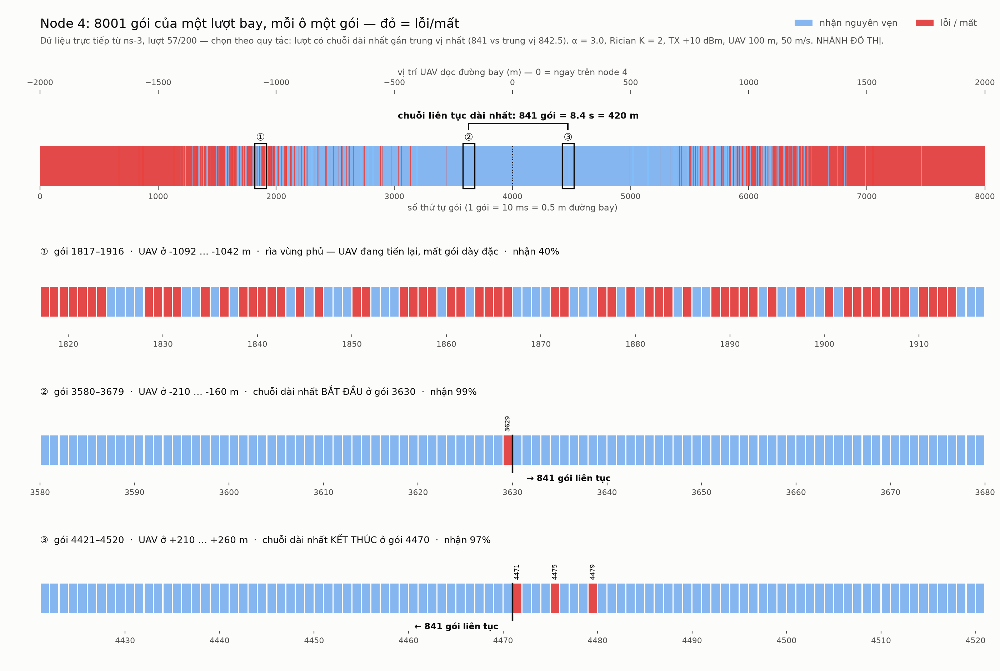
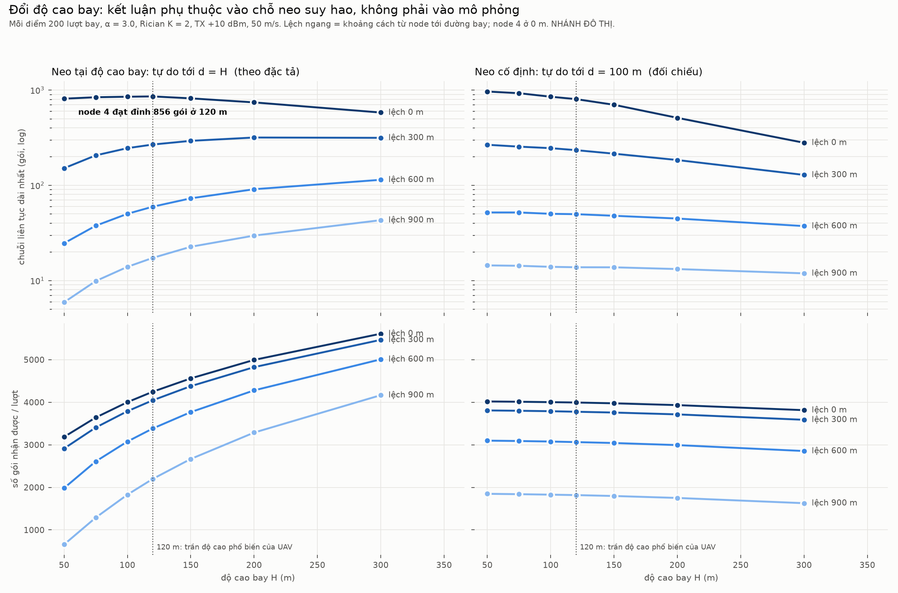
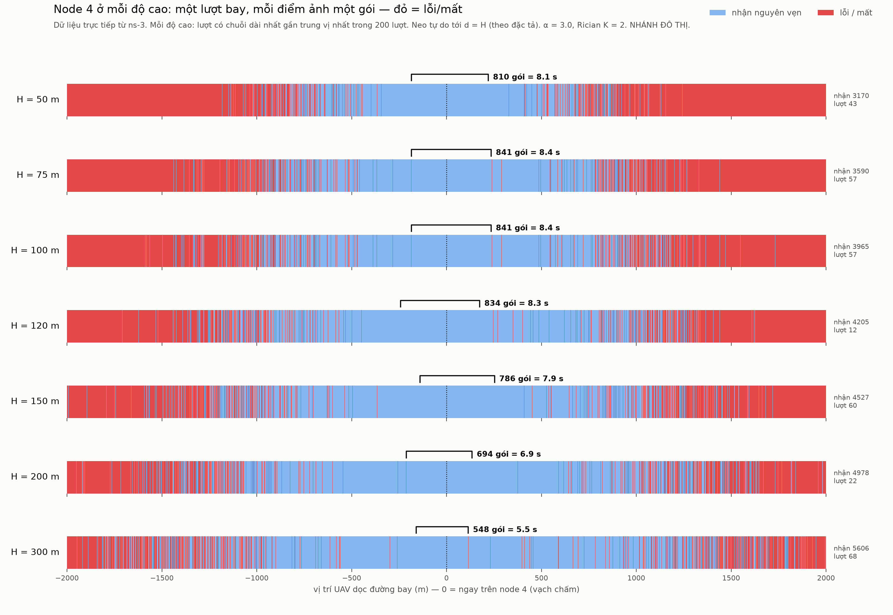

# Chuỗi gói liên tục dài nhất từ UAV bay ngang — nhánh đô thị

> ⚠️ **NHÁNH ĐÔ THỊ.** Mọi con số trong tài liệu này là của kênh không–đất **đô thị**.
> **Không** được đem sang kịch bản rừng — kịch bản đó có kênh riêng
> (`ForestA2gLossModel`) và tham số riêng (`sar-params.h`).

## 1. Câu hỏi

Mỗi node có thể nhận được **chuỗi gói liên tục** dài bao nhiêu trước khi mất một
gói? File không khôi phục được gói lỗi, nên chỉ chuỗi **liền mạch** mới có giá trị.

## 2. Kịch bản (đã chốt)

| | |
|---|---|
| Node | 7 node thẳng hàng, cách 300 m (lệch 900/600/300/0 m) |
| UAV | cao 100 m, 50 m/s, bay **vuông góc** qua đúng node 4, từ −2000 m tới +2000 m |
| Phát | PSDU 127 B (khung 133 B, **4.256 ms**), mỗi **10 ms**, đánh số → **8001 gói/lượt** |
| Công suất | TX **+10 dBm**, độ nhạy **−100 dBm**, ăng-ten **đẳng hướng** |
| Suy hao | tự do tới 100 m (**−80.05 dB**), sau đó `(d/100)^−α`, **α = 3.0** (quét 2.6, 3.35) |
| Fading | **Rician K = 2**, bốc lại **mỗi gói** |
| Che khuất | tắt |
| MAC | **bỏ qua** — bơm thẳng `LrWpanPhy::PdDataRequest`, không CSMA/ACK/beacon |
| Lặp | **200 lượt** mỗi cấu hình |

Hai đoạn suy hao chính là `ThreeLogDistancePropagationLossModel` của ns-3
(d₀ = 1 m, n₀ = 2, d₁ = 100 m, n₁ = α) — không cần lớp mới.

## 3. Kết quả — α = 3.0

| Node | Lệch | Cự ly gần nhất | Gói thu được | **Chuỗi dài nhất** | p10 – p90 |
|---|---|---|---|---|---|
| 4 | 0 m | 100 m | 4002 | **850 ± 226** | 554 – 1154 |
| 3, 5 | 300 m | 316 m | 3789 | **245 ± 85** | 155 – 355 |
| 2, 6 | 600 m | 608 m | 3077 | **50 ± 11** | 37 – 66 |
| 1, 7 | 900 m | 906 m | 1828 | **14 ± 2** | 11 – 17 |

Một gói = 10 ms = 0.5 m đường bay. Node 4 nhận liền ~850 gói ≈ **8.5 s**,
≈ **105 KB** tải 127 B/gói.

**Độ nhạy theo α** (chuỗi dài nhất, trung bình):

| α | node 4 | node 3,5 | node 2,6 | node 1,7 |
|---|---|---|---|---|
| 2.6 | 931 | 346 | 104 | 40 |
| **3.0** | **850** | **245** | **50** | **14** |
| 3.35 | 788 | 174 | 25 | 5 |

Node giữa gần như không nhạy α (−15 % từ 2.6 → 3.35); node xa nhất nhạy **8×**.

### Minh hoạ một lượt bay — từng gói một



Dữ liệu **trực tiếp** từ ns-3 (`--dump` ghi bitmap nhận/mất của từng gói). Lượt
được chọn **theo quy tắc**, không chọn tay: lượt có chuỗi dài nhất của node 4 gần
trung vị nhất — lượt 57, chuỗi 841 gói (trung vị 842.5). Ba khung phóng cũng chọn
theo quy tắc: ① cửa sổ 100 gói đầu tiên phía UAV tiến tới có tỉ lệ nhận 40–60 %,
② quanh điểm bắt đầu và ③ quanh điểm kết thúc của chuỗi dài nhất.

Điều hình cho thấy: chuỗi 841 gói **không** kết thúc vì UAV ra khỏi tầm — nó bị bẻ
bởi **một gói lỗi lẻ** (3629, rồi 4471) do fade sâu khi UAV mới cách ~200 m, nơi
tỉ lệ nhận vẫn 97–99 %. Đó chính là đuôi fade Rician ở mục 4.1.

## 4. Ba điều phát hiện khi cài

### 4.1 Nakagami m = 1.8 **không** tương đương Rician K = 2 cho chỉ số này

Đặc tả đề xuất Nakagami `m = (K+1)²/(2K+1) = 1.8` vì ns-3 không có Rician. Phép
khớp đó khớp **trung bình và phương sai** công suất, nhưng **không** khớp đuôi fade
sâu. Đo trực tiếp trên 11.2 triệu lần bốc trong ns-3:

| | P(< −10 dB) | P(< −20 dB) | P(< −30 dB) |
|---|---|---|---|
| Rician K = 2 | 4.6e-2 | 4.1e-3 | 4.1e-4 |
| Nakagami m = 1.8 | 2.4e-2 | 4.3e-4 | 8.1e-6 |

Ở −30 dB Rician fade **~50×** nhiều hơn. **Tổng số gói** do vùng rìa quyết định nên
gần như không đổi; **chuỗi dài nhất** do fade sâu hiếm quyết định nên lệch mạnh:

| | node 4 | node 3,5 | node 2,6 | node 1,7 |
|---|---|---|---|---|
| Nakagami ÷ Rician | **1.66×** | **2.40×** | 1.33× | 1.02× |

→ Đã viết lớp `RicianFadingLossModel` (bốc lại mỗi gói, mỗi máy thu) và dùng nó làm
chính. Nakagami vẫn chạy được bằng `--fading=nakagami` để đối chiếu.

### 4.2 "Độ nhạy −100 dBm" trong ns-3 **không** phải ngưỡng cứng

`SetRxSensitivity(S)` của ns-3.46 chỉ đặt hệ số tạp âm `F = S − (−106.58) = 6.58 dB`
và định nghĩa S là điểm **PER 1 % cho PSDU 20 B**. Thu hay không là đường BER theo
SINR. Đo bằng `--mode=calib` cho khung 127 B, không fading:

| | |
|---|---|
| PER ≤ 99 % từ | −102.25 dBm |
| **PER 50 %** tại | **−101.0 dBm** |
| PER ≤ 1 % từ | −99.25 dBm |

Tức ns-3 **hào phóng hơn ngưỡng cứng ~1 dB**. Lưu ý: hệ số tạp âm suy ra là 6.58 dB,
không phải 5 dB như bảng tham số — trong ns-3 hai đại lượng này **không độc lập**;
tôi giữ độ nhạy −100 dBm (in đậm trong đặc tả) và để F tự suy ra.

### 4.3 Bảng giải tích của đặc tả được tái tạo — và chênh lệch được giải thích trọn

| α = 3.0, chuỗi dài nhất | node 4 | node 3,5 | node 2,6 | node 1,7 |
|---|---|---|---|---|
| bảng trong đặc tả | 823 | 208 | 40 | 11 |
| giải tích, ngưỡng cứng −100 dBm | 817 | 203 | 40 | 10 |
| giải tích, **đường PER đo từ ns-3** | 845 | 244 | 52 | 14 |
| **mô phỏng ns-3** | **850** | **245** | **50** | **14** |

- Hàng 1 ≈ hàng 2: bảng của đặc tả đúng là **ngưỡng cứng + Rician K = 2**.
- Hàng 3 ≈ hàng 4: thay ngưỡng cứng bằng đường PER của ns-3 thì giải tích **trùng**
  mô phỏng. **Toàn bộ** chênh lệch giữa đặc tả và ns-3 là ~1 dB của mục 4.2.
- Đồng thời đây là kiểm chứng rằng mô phỏng làm đúng điều ta nghĩ.

α = 3.35 cũng vậy: đặc tả 740/151/20/4 · ngưỡng cứng 749/143/20/4 · ns-3 788/174/25/5.

## 5. Hai điểm phải ghi khi trích

### 5.1 Gói dài hơn thời gian kết hợp — kết quả **lạc quan**

50 m/s ở 2.4 GHz → Doppler 400 Hz → thời gian kết hợp ≈ **1.06 ms**, gói chiếm
sóng **4.256 ms**. Kênh đổi **trong lòng gói**, còn ns-3 (và đặc tả) giữ một mức
fade cho cả gói. Ước lượng cận bằng cách chia mỗi gói thành **4 khối fade độc lập**:

| α = 3.0, chuỗi dài nhất | node 4 | node 3,5 | node 2,6 | node 1,7 |
|---|---|---|---|---|
| ns-3 (1 fade / gói) | 850 | 245 | 50 | 14 |
| 4 fade / gói (cận bi quan) | 548 | 106 | 19 | 5 |
| **hệ số lạc quan** | **1.6×** | **2.3×** | **2.6×** | **2.8×** |

Hệ số là **1.6–2.8×, không phải ×4**. Và 4 khối độc lập là **cận bi quan** — tương
quan giảm dần chứ không cắt phẳng ở 1.06 ms — nên giá trị thật nằm **giữa hai hàng**.

### 5.2 Đây là thí nghiệm đô thị

Chỉ dùng cho nhánh đô thị. Không đưa sang kịch bản rừng.

## 5b. Đổi độ cao bay — 50 → 300 m

### Câu hỏi phải chốt trước: điểm gãy suy hao có đi theo độ cao không?

Đặc tả neo đoạn suy hao tự do tại **d_ref = H = 100 m**. Khi đổi H có hai cách hiểu,
và chúng cho **kết luận ngược nhau**:

| | đoạn tự do kéo tới | lý lẽ |
|---|---|---|
| **(a) d_ref = H** — theo đúng công thức đặc tả | độ cao bay | node ngay dưới luôn thấy UAV, nên ít nhất tới H là không gian tự do |
| **(b) d_ref = 100 m** — cố định, để đối chiếu | 100 m | 100 m là tính chất của kênh, không phải của hình học bay |

Chạy cả hai (`--alt`, `--dref`). Mỗi điểm 200 lượt, α = 3.0, Rician K = 2. Mọi độ cao
dùng **cùng seed** → mỗi gói gặp cùng một mức fade ở mọi độ cao (so sánh cặp): khác
biệt giữa các độ cao là do hình học, không do may rủi.

### (a) d_ref = H — theo đặc tả

| H (m) | biên SNR ngay trên đầu | chuỗi dài nhất: lệch 0 m | 300 m | 600 m | 900 m |
|---|---|---|---|---|---|
| 50 | 36.0 dB | 810 | 151 | 25 | 6 |
| 75 | 32.4 dB | 839 | 206 | 38 | 10 |
| 100 | 30.0 dB | 850 | 245 | 50 | 14 |
| **120** | 28.4 dB | **856** | 268 | 60 | 17 |
| 150 | 26.4 dB | 817 | 292 | 73 | 23 |
| 200 | 23.9 dB | 741 | 317 | 91 | 30 |
| 300 | 20.4 dB | 580 | 315 | 114 | 43 |

**Hai xu hướng ngược chiều:**

- **Node xa được lợi đều khi bay cao** — node 1/7 tăng từ 6 lên 43 gói, vì đoạn suy
  hao tự do dài ra theo H.
- **Node 4 đạt đỉnh ở ~120 m rồi giảm.** Bay cao làm UAV xa node 4 hơn ở điểm gần
  nhất, nên biên SNR ngay trên đầu tụt từ 36 xuống 20 dB. Chuỗi dài nhất do **fade
  sâu** quyết định (mục 4.1), mà biên càng mỏng thì càng nhiều fade đủ sâu để làm
  hỏng gói. Ngược lại, bay thấp (50 m) thì biên ngay trên đầu dày, nhưng vùng biên
  dày lại hẹp, vì sau 50 m suy hao đã dốc theo α.

Ở 300 m, node 4 nhận **nhiều gói hơn** (5610 so với 4002) nhưng chuỗi liền mạch lại
**ngắn hơn** (580 so với 850): phủ rộng hơn nhưng lốm đốm hơn.

### (b) d_ref = 100 m — đối chiếu

| H (m) | lệch 0 m | 300 m | 600 m | 900 m |
|---|---|---|---|---|
| 50 | 963 | 266 | 52 | 14 |
| 100 | 850 | 245 | 50 | 14 |
| 200 | 510 | 184 | 45 | 13 |
| 300 | 279 | 128 | 37 | 12 |

Ở đây bay cao **chỉ** làm xa thêm: mọi node đều kém đi, và thấp nhất là tốt nhất.

### ⚠️ Kết luận về độ cao do giả thiết quyết định, không do mô phỏng

Với (a), độ cao tối ưu cho node ngay dưới là ~120 m và node xa thì "càng cao càng
tốt". Với (b), "càng thấp càng tốt" cho mọi node. **Lợi ích của việc bay cao trong
(a) đã được cài sẵn vào mô hình**, qua việc kéo dài đoạn suy hao tự do. Không mô
hình nào trong hai cái đã được đo.

Cách chốt đúng là một mô hình theo **góc ngẩng**: xác suất có tầm nhìn thẳng tăng
khi góc ngẩng tăng (Al-Hourani 2014, có bộ tham số cho đô thị). Mô hình đó sẽ cho
thấy độ cao giúp được bao nhiêu, thay vì giả định trước. Chưa cài — chờ anh quyết.
Lưu ý thêm: α = 3.0 lấy từ phép đo ở độ cao thấp (Qiu 2017); ở 200–300 m, α thật
nhiều khả năng nhỏ hơn.

### Minh hoạ: node 4 ở mỗi độ cao





Mỗi dải là một lượt bay, chọn theo cùng quy tắc trung vị như mục 3. Ở 75 m và 100 m,
quy tắc chọn ra cùng lượt 57, và chuỗi bị bẻ ở đúng cùng hai gói (3629, 4471). Đó là
hệ quả của seed chung, đã kiểm tra: hai bitmap khác nhau ở 393 gói, nhưng quanh
điểm ngay trên đầu node 4, cả 4 gói mất ở 100 m đều cũng mất ở 75 m — các fade sâu
dùng chung.

## 6. Kiểm chứng tự động

Mỗi lần chạy kiểm (CHECK, không phải `assert` — ns-3 build NDEBUG):

- TX đo **từ chính tín hiệu** (trace `TxSigParams`) = **+10.000 dBm**, mọi gói.
- Suy hao trace (`PathLoss`) khớp công thức hai đoạn **sai số 0 dB** khi tắt fading
  → ăng-ten đúng 0 dBi, cấu hình suy hao đúng.
- Fading thực áp có công suất trung bình 1.0001 và đuôi khớp tham chiếu (±5 % ở −10 dB).
- Đủ **8001/8001** gói rời ăng-ten mỗi lượt; không trùng, không số thứ tự lạ.

Đối chứng không fading (`x30.csv`): chuỗi vẫn bị bẻ nhẹ ở rìa cửa sổ — đó là vùng
chuyển tiếp ~3 dB của đường PER, không phải lỗi.

## 7. Chạy lại

```bash
B=/home/user/ns3-dev/build/src/uav-sar/examples/ns3.46-uav-sar-a2g-run-test-optimized
$B --mode=calib --out=calib.csv
$B --alpha=3.0  --fading=rician   --passes=200 --out=r30.csv --dump=bits30.csv
$B --alpha=2.6  --fading=rician   --passes=200 --out=r26.csv
$B --alpha=3.35 --fading=rician   --passes=200 --out=r335.csv
$B --alpha=3.0  --fading=nakagami --passes=200 --out=n30.csv
python3 tools/a2g_run_report.py <thư mục csv> a2g-run.png
python3 tools/a2g_strip_figure.py bits30.csv r30.csv 4 a2g-strip-node4.png

# độ cao: với mỗi H trong 50 75 100 120 150 200 300
$B --alt=$H            --passes=200 --out=h$H.csv --dump=bits-h$H.csv
$B --alt=$H --dref=100 --passes=200 --out=f$H.csv
python3 tools/a2g_alt_figures.py <thư mục> a2g-alt.png a2g-alt-strips-node4.png
```

Mỗi cấu hình 200 lượt chạy ~30 s. Dữ liệu và hình: `docs/visualize/result/a2g-run/`,
`docs/visualize/result/a2g-run.png`.
