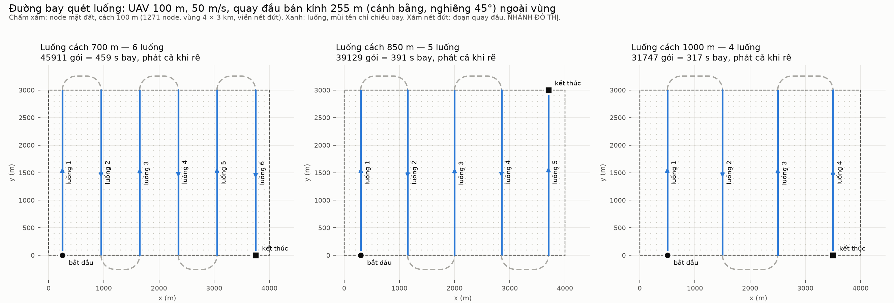
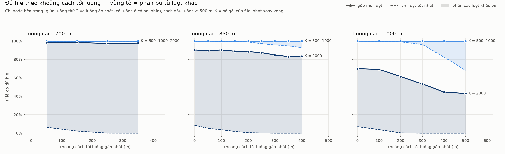
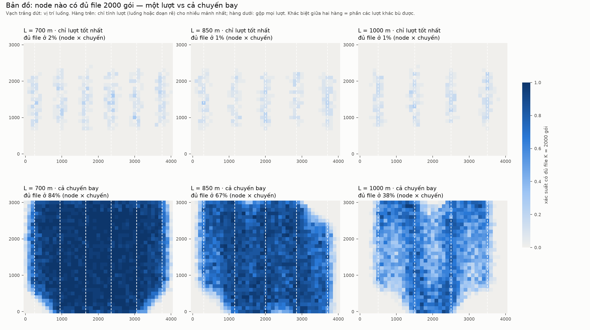
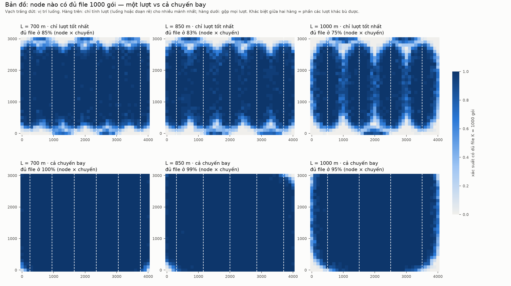
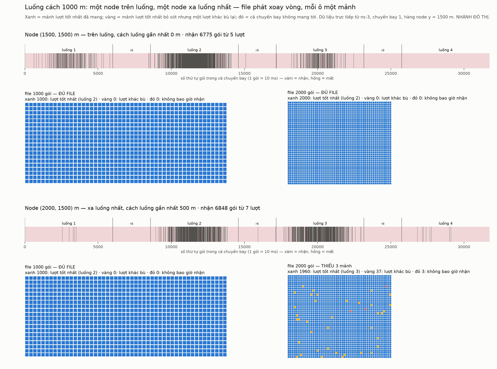

# Quét luống trên mạng sensor lớn — các lượt bay có bù được gói mất không?

> ⚠️ **NHÁNH ĐÔ THỊ.** Kênh và tham số giống hệt `A2G-RUN-vi.md` (dùng chung
> `examples/a2g-common.h`). **Không** đem sang kịch bản rừng.

## 1. Câu hỏi

Một UAV quét một vùng rộng theo luống song song, cách nhau 700 m – 1 km, phát liên
tục các gói đánh số. Node nằm xa đường bay mất nhiều gói. **Các lượt bay khác có bù
được những gói đó không?**

## 2. Điều kiện để "bù" có nghĩa

Gói đã mất chỉ bù được nếu **cùng nội dung được phát lại**. Nếu số thứ tự cứ tăng
mãi mà không lặp, không có gì để bù. Vì vậy UAV phát **một file K gói, xoay vòng**:
gói thứ `s` (số thứ tự toàn cục, tăng dần) mang mảnh `s mod K` — đúng nguyên tắc
quay vòng đều (I4) của dự án.

Giả lập lưu **toàn bộ lịch sử nhận** của từng node, nên mọi K (50 … 2000) được
đánh giá từ **cùng một** chuyến bay, không cần bay lại.

Có **hai** cơ chế bù khác nhau, và phần phân tích tách riêng chúng:

| | khi nào xảy ra |
|---|---|
| **bù trong cùng lượt** | file ngắn hơn cửa sổ thu của một lượt → cùng mảnh quay lại trước khi UAV đi xa |
| **bù từ lượt khác** | một luống khác (hoặc một đoạn quay đầu) mang tới mảnh mà lượt tốt nhất bỏ sót |

Với mỗi node: **best** = số mảnh khác nhau mà **một** đoạn bay tốt nhất mang tới;
**union** = số mảnh cả chuyến bay mang tới. `union − best` chính là phần bù từ lượt
khác.

## 3. Kịch bản

| | |
|---|---|
| Vùng | 4 km (ngang luống) × 3 km (dọc luống), node cách **100 m** → **1271 node** |
| Khoảng luống L | **700 / 850 / 1000 m** → 6 / 5 / 4 luống, đặt đối xứng giữa vùng |
| Bay | 100 m, 50 m/s, **phát mỗi 10 ms kể cả khi quay đầu** |
| Quay đầu | cánh bằng nghiêng 45° → bán kính **255 m**: ¼ cung + thẳng + ¼ cung, ngoài vùng |
| Kênh | tự do tới 100 m rồi α = 3.0, Rician K = 2 bốc lại mỗi gói, TX +10 dBm, độ nhạy −100 dBm |
| Lặp | **24 chuyến bay độc lập** mỗi khoảng luống (mỗi chuyến 1271 node) |

Ở H = 100 m, hai cách neo suy hao của `A2G-RUN-vi.md` §5b **trùng nhau**
(d_ref = H = 100 m), nên kết quả ở đây không phụ thuộc vào câu hỏi neo còn treo.



| L | số luống | quãng bay | thời gian | số gói |
|---|---|---|---|---|
| 700 m | 6 | 22 955 m | 459 s | 45 911 |
| 850 m | 5 | 19 564 m | 391 s | 39 129 |
| 1000 m | 4 | 15 873 m | 317 s | 31 747 |

## 4. Kết quả

Bảng dưới chỉ lấy **node bên trong**: nằm giữa luống thứ 2 và luống áp chót (có luống
ở cả hai phía), cách đầu luống ≥ 500 m. "Đủ file" = tỉ lệ cặp (node, chuyến bay) có
trọn K mảnh; trong ngoặc là số mảnh còn thiếu trung bình.

### K = 500 — một lượt là đủ, ở mọi khoảng cách, mọi khoảng luống

100 % đủ file chỉ từ lượt tốt nhất. Toàn bộ việc bù diễn ra **trong cùng lượt**.

### K = 1000 — lượt khác bù trọn phần còn thiếu

| L | cách luống | đủ file: một lượt → cả chuyến |
|---|---|---|
| 850 m | 400 m | 92.9 % → **100 %** |
| 1000 m | 300 m | 96.2 % → **100 %** |
| 1000 m | 400 m | 82.5 % → **100 %** |
| 1000 m | 500 m (giữa hai luống) | 68.3 % → **100 %** |

Với L = 700 m, một lượt đã cho ≥ 99 % ở mọi khoảng cách.

### K = 2000 — một lượt gần như không bao giờ đủ; các lượt khác là quyết định

| cách luống | L = 700 m | L = 850 m | L = 1000 m |
|---|---|---|---|
| ~0–50 m | 6.3 % → **98.4 %** | 8.5 % → **90.3 %** | 6.9 % → **70.0 %** |
| ~200–250 m | 0.1 % → **97.4 %** | 0.5 % → **88.5 %** | 0.3 % → **61.3 %** |
| ~350–400 m | 0.0 % → **97.8 %** | 0.0 % → **83.6 %** | 0.0 % → **44.6 %** |
| 500 m | — | — | 0.0 % → **43.1 %** |

Đáng chú ý: một lượt mang được **99 %+ số mảnh** (thiếu trung bình 4–54 mảnh),
nhưng gần như không bao giờ **trọn** file — mà tiêu chí là trọn file. Các lượt khác
lấp chính những mảnh lẻ đó: sau khi gộp, số mảnh thiếu trung bình còn **< 1**.

### Toàn vùng (kể cả mép)

| L | K = 1000: một lượt → cả chuyến | K = 2000: một lượt → cả chuyến |
|---|---|---|
| 700 m | 85.4 % → 99.6 % | 1.6 % → **83.9 %** |
| 850 m | 82.5 % → 98.9 % | 1.3 % → **67.2 %** |
| 1000 m | 75.4 % → 94.5 % | 1.1 % → **37.6 %** |



## 5. Trả lời câu hỏi

**Có — các lượt khác bù được, và bù đúng chỗ cần.** Nhưng mức cần bù phụ thuộc
vào kích thước file:

1. **File nhỏ (K ≤ 500): không cần lượt khác.** Một lượt đi ngang phát vòng file
   nhiều lần, nên gói mất được bù ngay trong lượt đó.
2. **File vừa (K = 1000): lượt khác lấp trọn chỗ hổng ở node xa.** Với L = 1000 m,
   node giữa hai luống tăng từ 68 % lên 100 %.
3. **File lớn (K = 2000): chỉ có lượt khác mới làm được.** Một lượt gần như không
   bao giờ đủ, nên kết quả do **mật độ luống** quyết định: 98 % (700 m), 84–90 %
   (850 m), 43–70 % (1000 m).

**Node giữa hai luống không phải chỗ kém nhất khi luống dày.** Với L = 700 m, node
cách 350 m nghe được 5.3 luống (so với 4.7 ở node sát luống), nên tỉ lệ đủ file
ngang ngửa node trên luống. Khoảng cách tới luống **gần nhất** không phải biến quyết
định — **số luống nghe được** mới là.

## 6. Những gì bản đồ cho thấy thêm



- **Đoạn quay đầu cũng là một lượt bù.** Với L = 1000 m, vùng đậm nhất nằm ngay chỗ
  có vòng quay đầu (đáy giữa luống 2–3; đỉnh giữa luống 1–2 và 3–4), còn các góc
  không có vòng quay thì nhạt. Phát cả khi rẽ là có ích.
- **Mép vùng theo chiều ngang luống yếu hơn hẳn.** Node quanh luống ngoài cùng chỉ có
  luống láng giềng ở một phía. Đã kiểm với L = 850 m: chúng nghe được 3 luống và đạt
  53–58 %, trong khi node quanh luống bên trong nghe ~5 luống và đạt ~90 %. Nếu không
  tách, hiệu ứng này giả dạng thành hiệu ứng khoảng cách (đường cong răng cưa 55 % ↔
  90 %) — vì vậy bảng và đường cong chỉ dùng node bên trong.



## 7. Minh hoạ một node



Hai node chọn theo quy tắc trong hàng y = 1500 m của chuyến bay 1: node trên luống
và node xa luống nhất (đều gần giữa hàng nhất). Node xa luống nhất (2000, 1500) với
file 2000 gói: **1960** mảnh từ luống 3, **37** mảnh do lượt khác bù, **3** mảnh
không bao giờ tới. Hình cho L = 700 / 850 m: `a2g-sweep-node-L700.png`,
`a2g-sweep-node-L850.png`.

## 8. Phải ghi khi trích

- **Fading giữ nguyên trong cả gói là lạc quan** (`A2G-RUN-vi.md` §5.1: chuỗi ngắn
  đi 1.6–2.8× nếu kênh đổi trong lòng gói). Nhiều gói mất hơn nghĩa là một lượt kém
  đi, và phần bù từ lượt khác **càng quan trọng hơn** — xu hướng giữ nguyên, các con
  số tuyệt đối thì lạc quan.
- **Một máy phát duy nhất**, không có lưu lượng mặt đất, không nhiễu.
- **Đây là nhánh đô thị.**

## 9. Kiểm chứng

Mỗi chuyến bay kiểm (CHECK, ~110 000 lần mỗi tiến trình, tất cả qua):

- công suất phát đo từ chính tín hiệu = +10.000 dBm; đủ mọi gói rời ăng-ten;
- fading thực áp có trung bình 1.000 và đuôi khớp Rician K = 2 (±5 % ở −10 dB);
- **máy bay cách vị trí kế hoạch ≤ 0.5 m ở mọi lần phát** (kể cả trong vòng quay);
- đường bay liên tục, tốc độ đều: mọi bước 1 m dọc đường dài 0.999–1.001 m;
- với mọi node và mọi K: `best ≤ union ≤ min(K, số gói nhận)`.

`MaxLossDb = 120 dB` là **chính xác**, không phải xấp xỉ: dưới −109.4 dBm, chính ns-3
đã bỏ tín hiệu (SINR < −5 dB), và fading được bốc trước khi cắt. Đã kiểm: kết quả
ở 125 dB và 120 dB trùng từng byte (255 s → 168 s mỗi chuyến).

Tách `a2g-common.h` ra khỏi `a2g-run-test.cc`: `r30.csv`, `h100.csv`, `calib.csv`
đều tái tạo trùng từng byte.

## 10. Chạy lại

```bash
B=/home/user/ns3-dev/build/src/uav-sar/examples/ns3.46-uav-sar-a2g-sweep-test-optimized
for L in 700 850 1000; do for f in 1 7 13 19; do
  $B --spacing=$L --runs=6 --firstRun=$f --out=s$L-r$f &
done; done; wait            # ~1 giờ trên 4 lõi
python3 tools/a2g_sweep_report.py <thư mục> docs/visualize/result 1000
```

Lưu ý tái tạo: ns-3 cấp chỉ số luồng ngẫu nhiên từ một bộ đếm **không đặt lại** giữa
các chuyến bay trong cùng tiến trình. Các chuyến vẫn độc lập với nhau, và chạy lại
**đúng cách chia trên** (4 tiến trình × 6 chuyến, `--firstRun` = 1/7/13/19) sẽ tái tạo
chính xác. Đổi cách chia thì vẫn ra kết quả tương đương về thống kê, nhưng từng
chuyến sẽ khác (xem `G2G-CHAIN-vi.md` §8).

Đã commit: `docs/visualize/result/a2g-sweep/` — trung bình theo node qua 24 chuyến
(`s*-node-means.csv`), đường bay, bitmap hàng y = 1500 m của chuyến bay 1, và báo cáo.
Dữ liệu thô từng chuyến (13.5 MB) không commit; chạy lại lệnh trên để tái tạo.
