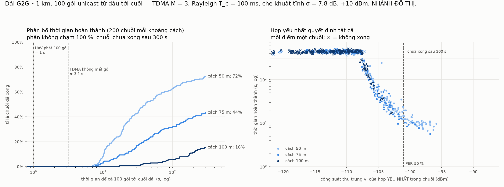
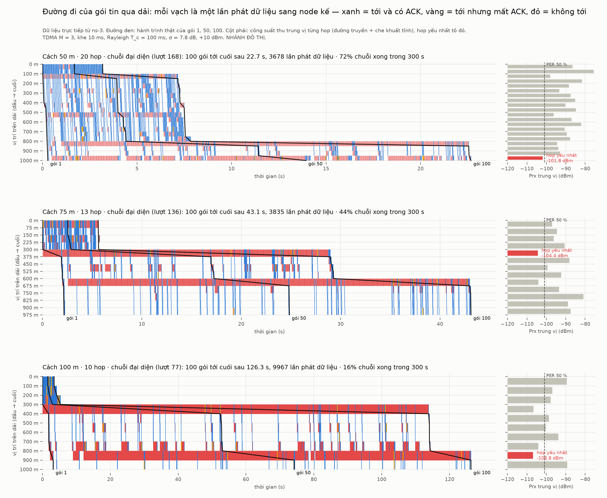
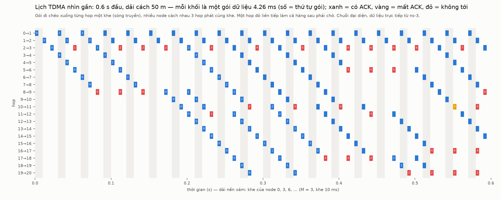
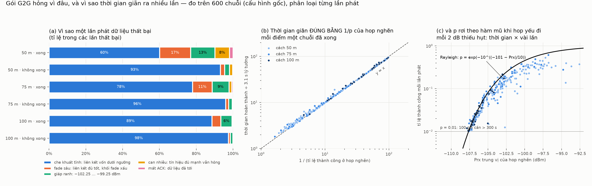
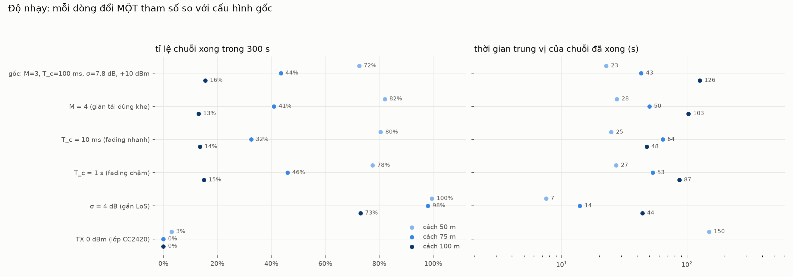

# Hợp tác tại biên: một file đi qua cụm rộng bằng chuỗi G2G

> ⚠️ **NHÁNH ĐÔ THỊ.** Kênh lấy từ `examples/a2g-common.h` (`G2gLinkLossModel`).
> **Không** đem sang kịch bản rừng.

## 1. Câu hỏi

Một cụm đủ rộng để UAV không phủ hết trong một lần: một đầu có những gói mà đầu kia
không có. Các node nằm trên một dải, cách nhau 50–100 m. Node đầu giữ **100 gói**
cần tới node cuối, đi **unicast lần lượt qua từng node** trên một đường cố định.
**Mất bao lâu?**

## 2. G2G khác A2G ở ba chỗ — cả ba đều được mô hình hoá

| | A2G (các thí nghiệm trước) | G2G (ở đây) |
|---|---|---|
| **Kênh** | tự do tới 100 m rồi α = 3.0; Rician K = 2 | n = **3.5** từ 1 m; **Rayleigh** (toàn tia NLoS) |
| **Biến thiên** | UAV bay 50 m/s → fade mới mỗi gói | node đứng yên → **che khuất tĩnh** σ = 7.8 dB cho mỗi cặp node (thuận nghịch), fading **giữ nguyên trong khối T_c = 100 ms** |
| **Truy nhập** | một máy phát, quảng bá | **TDMA chặt**: khe 10 ms, node i phát ở khe `i mod M`, M = 3; node cách nhau M hop dùng chung khe |
| **Giao nhận** | không ACK | **unicast + ACK** trong cùng khe; không có ACK sau 9 ms → phát lại ở khe kế tiếp của mình; gói trùng thì ACK lại nhưng không xếp hàng |

Các con số tôi tự chọn (đặc tả chưa chốt), mỗi số đều kèm một lần chạy độ nhạy ở
mục 5:

| | giá trị | lý do |
|---|---|---|
| Dải | ~1 km: 20 / 13 / 10 hop ở 50 / 75 / 100 m | "cụm đủ rộng": một lượt UAV phủ cỡ đó |
| n | 3.5 | bằng `kG2GExponent` sẵn có; khớp độ dốc 3GPP UMi-NLoS (35.3) |
| σ | 7.8 dB | 3GPP UMi-NLoS (7.82) |
| TX | +10 dBm | cùng loại radio với UAV |
| Giới hạn | 300 s | quá thời gian này coi là không xong |

**Quỹ đường truyền** — công suất thu trung vị một hop, so với điểm PER 50 % của
ns-3 (khoảng −101 dBm, khung 127 B):

| | 50 m | 75 m | 100 m |
|---|---|---|---|
| +10 dBm | −89.5 dBm (biên 11.5 dB) | −95.7 dBm (biên 5.3 dB) | −100.0 dBm (**biên 1 dB**) |
| 0 dBm | −99.5 dBm | −105.7 dBm | −110.0 dBm |

Ở 100 m, ngay cả khi **không** có che khuất và fading, mỗi hop đã mất khoảng 6 % gói.

## 3. Kiểm chứng trước khi tin bất kỳ con số nào

**Tự kiểm lịch TDMA** (`--selftest`: tắt che khuất và fading, dải 50 m): gói thứ k
phải tới đuôi đúng tại `(k·M + H − 1)·10 ms + 0.192 ms + 4.256 ms`. **Khớp tới
micro-giây cho từng gói, với M = 3, 4, 5, không lần phát lại nào.** Với M = 3, 100
gói qua 20 hop mất **3.164 s** — đó là mức lý tưởng.

Mỗi lần chạy còn kiểm:

- che khuất thực bốc có σ = 7.80 dB; fading Rayleigh có P(<−10 dB) = 0.0957
  (lý thuyết 0.0952), P(<−20 dB) = 0.0099 (lý thuyết 0.0100);
- **bảo toàn luồng**: số gói khác nhau mỗi node giữ không bao giờ tăng dọc dải;
- mỗi ACK đều ứng với dữ liệu mà node sau thật sự đã nhận;
- không lần phát nào bị PHY từ chối.

Một bất biến tôi viết ban đầu bị **sai** và đã được thay: "số gói đã ACK ở mỗi hop
≥ số gói tới đuôi". Khi ACK bị mất, gói đã chạy lên trước trong khi node gửi vẫn
đang phát lại, nên bất đẳng thức đó có thể không đúng một cách hợp lệ.

## 4. Kết quả — cấu hình gốc, 200 chuỗi mỗi khoảng cách

| cách | hop | **xong trong 300 s** | trung vị | p10 – p90 | gói tới đuôi (TB) |
|---|---|---|---|---|---|
| 50 m | 20 | **72.5 %** | **22.7 s** | 9.7 – 123 s | 77.6 / 100 |
| 75 m | 13 | **43.5 %** | **43.1 s** | 11.5 – 177 s | 52.3 / 100 |
| 100 m | 10 | **15.5 %** | **126 s** | 36 – 228 s | 23.3 / 100 |

Để so sánh: TDMA không mất gói cần **3.1 s**. Còn UAV quảng bá 100 gói tới một node
nằm dưới nó chỉ mất **1 s**.



### Hop yếu nhất quyết định tất cả

Lấy công suất thu trung vị của **hop tệ nhất** trong mỗi chuỗi:

| hop yếu nhất | 50 m: xong · trung vị | 75 m | 100 m |
|---|---|---|---|
| < −110 dBm | 0 % | 0 % | 0 % |
| −110 … −106 dBm | 42 % · 139 s | 37 % · 155 s | 36 % · 175 s |
| −106 … −104 dBm | **100 %** · 54 s | 100 % · 46 s | 100 % · 48 s |
| −104 … −102 dBm | 100 % · 24 s | 100 % · 26 s | 100 % · 17 s |
| −102 … −100 dBm | 100 % · 15 s | 100 % · 12 s | — |
| −100 … −95 dBm | 100 % · 10 s | 100 % · 9 s | — |

**Ba khoảng cách cho cùng một quy luật.** Khoảng cách chỉ tác động gián tiếp, qua
xác suất chuỗi có một hop xấu. Đây là hiệu ứng **thống kê cực trị**:

- 20 hop là 20 lần bốc che khuất độc lập, và lần tệ nhất trung bình khoảng −1.87σ ≈
  **−14.6 dB**.
- Vì che khuất **tĩnh**, hop đó xấu **mãi mãi**, và trên một đường cố định không có
  cách nào vòng qua nó.
- Dải dày hơn có biên trung vị tốt hơn nhưng nhiều hop hơn, tức nhiều cơ hội gặp một
  hop chết hơn. Hai hiệu ứng triệt tiêu một phần nhau — vì vậy 50 m chỉ đạt 72 %,
  không phải ~100 %.

### Nhìn tận mắt: gói đi qua dải



Mỗi panel là một chuỗi **đại diện**, chọn theo quy tắc: trong các chuỗi đã xong,
chuỗi có thời gian gần trung vị nhất. Dải đỏ dày đặc nằm đúng ở hop yếu nhất (cột
phải). Gói 1 đi qua phần đầu dải gần như tức thì (đoạn thẳng đứng sát trục), rồi
**kẹt** ở hop xấu. Mọi gói phía sau dồn lại và chờ ở đó.



0.6 s đầu ở dải 50 m: gói đi chéo xuống từng hop một khe, và các node cách nhau 3
hop phát cùng khe. Một hop đỏ liên tiếp làm cả dòng phía sau phải chờ.

## 4b. Gói hỏng vì đâu, và vì sao thời gian giãn ra nhiều lần

Mỗi lần phát dữ liệu được phân loại tại thời điểm hết hạn chờ ACK, dựa trên những gì
kênh **thật sự áp dụng** (trace `PathLoss` của ns-3: công suất thu đã gồm fading,
và can nhiễu từ các node phát cùng khe). Ngưỡng lấy từ đường PER đã đo của ns-3 cho
khung 127 B: dưới −102.25 dBm gần như luôn hỏng, trên −99.25 dBm gần như không bao giờ
hỏng nếu chỉ có tạp âm. Phép đo chỉ đọc trace, không bốc số ngẫu nhiên nào: kết quả
chạy lại **trùng từng byte**, và mỗi lần phát đều được kế toán đúng một nguyên nhân
(CHECK, sai lệch ≤ 1 lần đang dở dang khi dừng).

### Nguyên nhân: che khuất tĩnh, áp đảo

| tỉ lệ trong các lần thất bại | che khuất tĩnh | fade sâu | giáp ranh | can nhiễu | mất ACK |
|---|---|---|---|---|---|
| 50 m · chuỗi xong | **60 %** | 17 % | 13 % | 8 % | 2 % |
| 50 m · không xong | **93 %** | 2 % | 3 % | 2 % | 0.2 % |
| 75 m · chuỗi xong | **78 %** | 11 % | 9 % | 1 % | 0.7 % |
| 75 m · không xong | **96 %** | 2 % | 2 % | 0.3 % | 0.1 % |
| 100 m · chuỗi xong | **89 %** | 5 % | 6 % | 0.2 % | 0.4 % |
| 100 m · không xong | **98 %** | 1 % | 1 % | 0.0 % | 0.1 % |

- **Che khuất tĩnh** = công suất thu nằm dưới ngưỡng, và công suất *trung vị* của
  liên kết (suy hao + che khuất, chưa tính fading) **cũng** dưới điểm PER 50 %. Liên
  kết vốn đã chết; gói chỉ lọt qua khi fading Rayleigh tình cờ tạo ra một khối cộng
  hưởng mạnh.
- **Tại hop nghẽn** của các chuỗi đã xong: che khuất tĩnh chiếm **86 / 93 / 96 %**
  thất bại ở 50 / 75 / 100 m.
- **Can nhiễu chỉ đáng kể ở 50 m** (8 % thất bại trong các chuỗi xong): ở M = 3, node
  phát cùng khe chỉ cách máy thu 100 m. Điều này khớp với việc M = 4 giúp được một
  chút ở 50 m (72 → 82 %) nhưng không giúp gì ở 75–100 m.
- **Mất ACK không đáng kể** (≤ 2 %).

### Vì sao thời gian giãn ra nhiều lần: đúng bằng 1/p của hop nghẽn

Lịch TDMA cho mỗi hop **một lần phát mỗi khung** (M × 10 ms = 30 ms). Không mất gói,
100 gói xếp hàng nối đuôi nhau qua dải, mất 100 × 30 ms ≈ **3 s** — đó là mức 3.1 s
lý tưởng.

Khi một hop chỉ thành công với xác suất p, mỗi gói cần trung bình **1/p** khung để
qua hop đó. Các hop khác chỉ ngồi chờ. Thời gian hoàn thành vì vậy là:

> **T ≈ (số lần phát ở hop nghẽn) × 30 ms ≈ 100 × 30 ms / p_nghẽn = 3.1 s / p_nghẽn**

Đo trên các chuỗi đã xong:

| | T ÷ (số lần phát ở hop nghẽn × 30 ms) | p hop nghẽn (trung vị) | 1/p | T ÷ 3.1 s (đo) |
|---|---|---|---|---|
| 50 m | 1.04 | 0.137 | **7.3×** | **7.3×** |
| 75 m | 1.03 | 0.074 | **13.6×** | **13.9×** |
| 100 m | 1.02 | 0.025 | **40.5×** | **40.7×** |

Hop nghẽn bận **suốt** thời gian truyền (tỉ số 1.02–1.04), và độ giãn khớp 1/p tới
từng chuỗi (hình b).

### Vì sao chỉ vài dB đã thành "gấp nhiều lần": p rơi theo hàm mũ

Với fading Rayleigh và một ngưỡng xấp xỉ −101 dBm, một lần phát chỉ thành công nếu
fade vượt được phần thiếu hụt:

> **p = exp(−10^((−101 − Prx_trung vị)/10))**

Tương quan log giữa p dự đoán và p đo ở hop nghẽn là **0.93–0.97**. Phần thiếu hụt
nằm **trong luỹ thừa của luỹ thừa**, nên:

| Prx trung vị hop nghẽn | p | thời gian cho 100 gói |
|---|---|---|
| −101 dBm | 0.37 | ~8 s |
| −104 dBm | 0.14 | ~23 s |
| −106 dBm | 0.04 | ~75 s |
| −108 dBm | 0.007 | ~465 s → **không xong trong 300 s** |

Đó là "vách" ở khoảng −107 dBm trong bảng hop yếu nhất (mục 4). Cứ thiếu thêm 2 dB,
thời gian nhân lên **3–6 lần**.



Trong hình (c), vài điểm ở vùng tốt (−97…−93 dBm) nằm dưới đường Rayleigh. Đó là các
chuỗi không có hop thật sự yếu: hop "nghẽn" chỉ là hop có nhiều lần phát nhất, và
thất bại của nó đến từ can nhiễu hoặc vùng giáp ranh, không phải che khuất.

## 5. Độ nhạy — mỗi dòng đổi MỘT tham số

| cấu hình | 50 m | 75 m | 100 m |
|---|---|---|---|
| **gốc** (M=3, T_c=100 ms, σ=7.8 dB, +10 dBm) | 72.5 % · 23 s | 43.5 % · 43 s | 15.5 % · 126 s |
| M = 4 | 82.0 % · 28 s | 41.0 % · 50 s | 13.0 % · 103 s |
| T_c = 10 ms (fading nhanh) | 80.5 % · 25 s | 32.5 % · 64 s | 13.5 % · 48 s* |
| T_c = 1 s (fading chậm) | 77.5 % · 27 s | 46.0 % · 53 s | 15.0 % · 87 s |
| **σ = 4 dB (gần LoS)** | **99.5 %** · 7.5 s | **98.0 %** · 14 s | **73.0 %** · 44 s |
| **TX 0 dBm (lớp CC2420)** | **3.0 %** · 150 s | **0 %** | **0 %** |

\* chỉ 27 chuỗi xong, trung vị kém tin cậy.



- **Can nhiễu không phải nút thắt.** Giãn tái dùng khe gần như không đổi gì: M = 4 ở
  bảng trên; trong lần chạy thử 20 chuỗi ở 50 m, M = 3 / 4 / 6 cho 10 / 10 / 12 chuỗi
  xong, còn M = 25 cho 9 (mỗi node ít khe hơn). Giả thuyết ban đầu của tôi là can
  nhiễu tĩnh; dữ liệu bác bỏ nó.
- **Tốc độ fading tác động ít.** Phần quyết định là trung vị của hop xấu, tức che
  khuất tĩnh — không phải fading quay nhanh hay chậm.
- **σ mới là tham số then chốt.** Chỉ cần đổi σ từ 7.8 xuống 4 dB, 50–75 m thành gần
  100 %. Vì vậy giả định "mọi liên kết đều NLoS" phải được ghi rõ: theo 3GPP UMi,
  liên kết 50 m ở mặt đất có khoảng 67 % xác suất LoS. Kết quả gốc là **trường hợp
  bi quan có cơ sở**, không phải trường hợp điển hình.
- **Radio 0 dBm thì dải G2G 1 km không hoạt động.**

## 6. Ý nghĩa cho hợp tác tại biên

- **Đường cố định dài ~1 km là mong manh.** Một hop xấu chặn cả file, và với che khuất
  tĩnh, phát lại bao nhiêu cũng không giải quyết được. Đi qua cụm theo **một** đường
  cho trước mất từ hàng chục tới hàng trăm giây, hoặc không bao giờ xong — so với 1 s
  khi UAV quảng bá trực tiếp.
- Thứ cứu được chuỗi **không phải** lịch truyền hay tốc độ phát lại. Đó là **tránh
  hop chết**: chọn đường theo chất lượng liên kết đo được, hoặc cho phép bỏ qua một
  node — tức không cố định đường.

## 7. Phải ghi khi trích

- **Mọi liên kết NLoS, σ = 7.8 dB** — bi quan có cơ sở (mục 5).
- Che khuất **độc lập giữa các cặp**: chưa mô hình tương quan không gian (3GPP
  UMi-NLoS: khoảng cách tương quan ~13 m). Với hop 50–100 m, ảnh hưởng nhỏ.
- **Đồng bộ khe hoàn hảo**; chưa tính trôi đồng hồ.
- **Nhánh đô thị.**

## 8. Tái tạo

ns-3 cấp chỉ số luồng ngẫu nhiên từ một bộ đếm toàn cục, **không đặt lại** giữa các
chuỗi trong cùng tiến trình. Hệ quả:

- Mỗi chuỗi vẫn độc lập với các chuỗi khác.
- Cả chiến dịch tái tạo chính xác khi chạy lại đúng như cũ.
- Nhưng chuỗi thứ r chỉ tái tạo được bằng cách chạy lại 1…r: `--runs=r --traceRun=r`.

Đã kiểm: ba chuỗi đại diện chạy lại trùng từng dòng với chiến dịch.

```bash
B=/home/user/ns3-dev/build/src/uav-sar/examples/ns3.46-uav-sar-g2g-chain-test-optimized
$B --selftest=1 --spacing=50 --slots=3 --runs=2        # schedule, to the microsecond
for s in 50 75 100; do
  $B --runs=200 --limit=300 --spacing=$s --slots=3 --out=main-s$s-M3
  # biến thể: --slots=4 | --coh=0.01 | --coh=1.0 | --sigma=4 | --tx=0
done
python3 tools/g2g_chain_report.py select <thư mục>     # chuỗi đại diện r cho mỗi s
$B --spacing=$s --slots=3 --runs=$r --traceRun=$r --limit=300 --out=rep-s$s
python3 tools/g2g_chain_report.py report <thư mục> docs/visualize/result
```

Đã commit `docs/visualize/result/g2g-chain/`: kết quả theo chuỗi và theo hop của cả
18 cấu hình, trace của 3 chuỗi đại diện, báo cáo. Bảng và cả bốn hình đã được vẽ lại
**y hệt** chỉ từ thư mục này. Chưa commit thời điểm đến của từng gói (6.2 MB; không
dùng cho hình).
